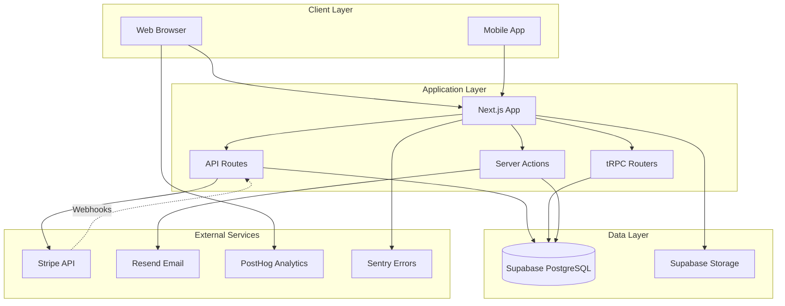
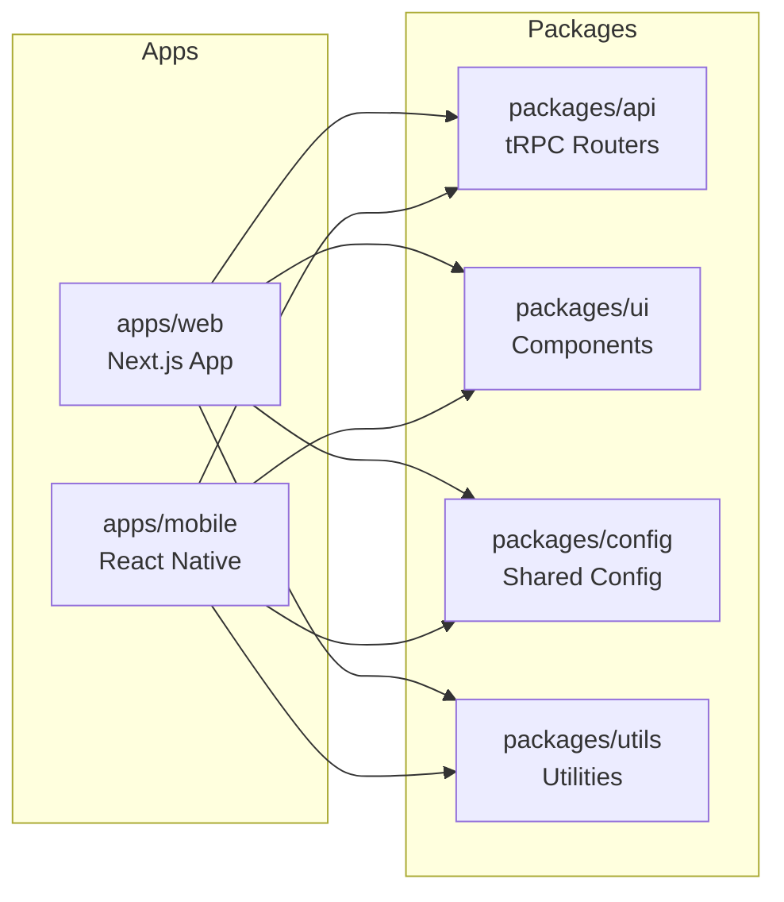
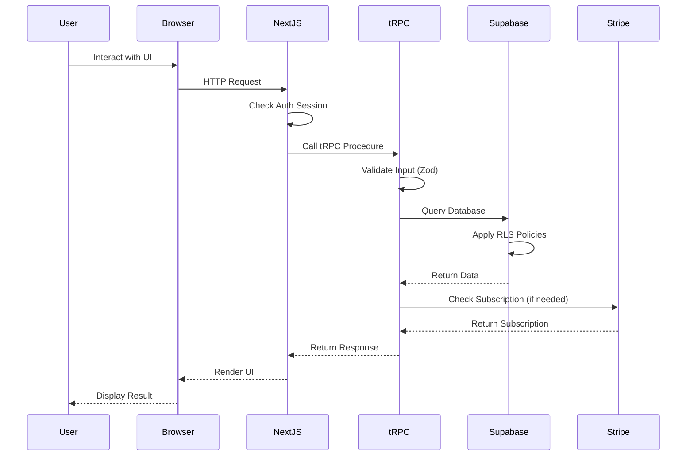
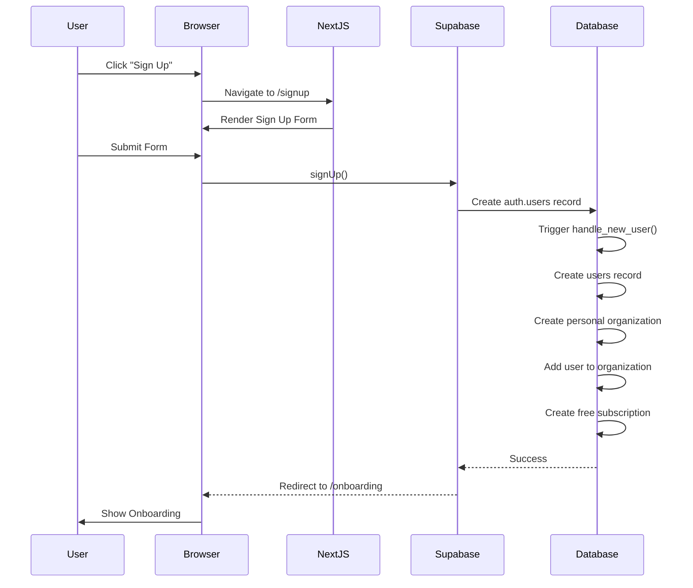
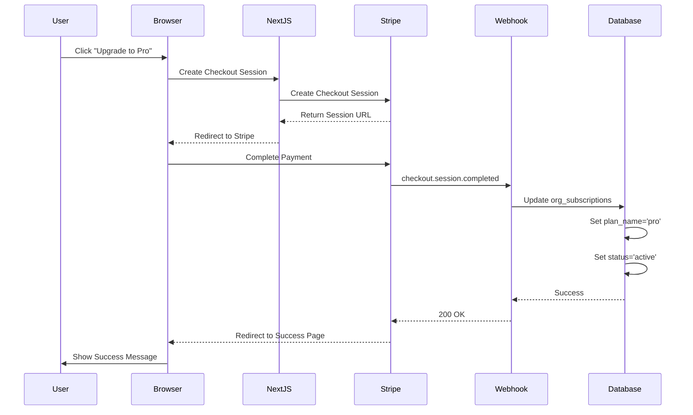
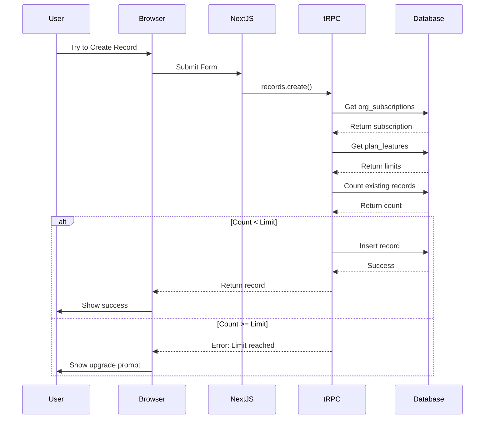
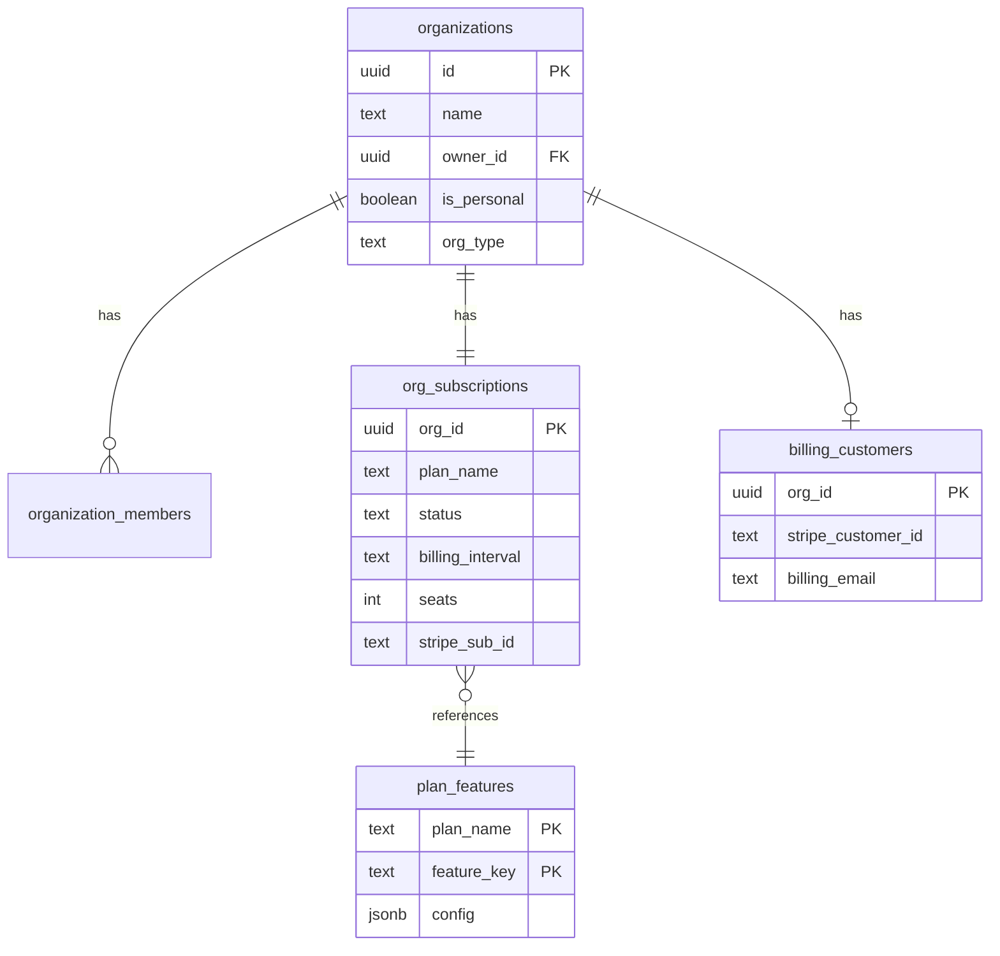
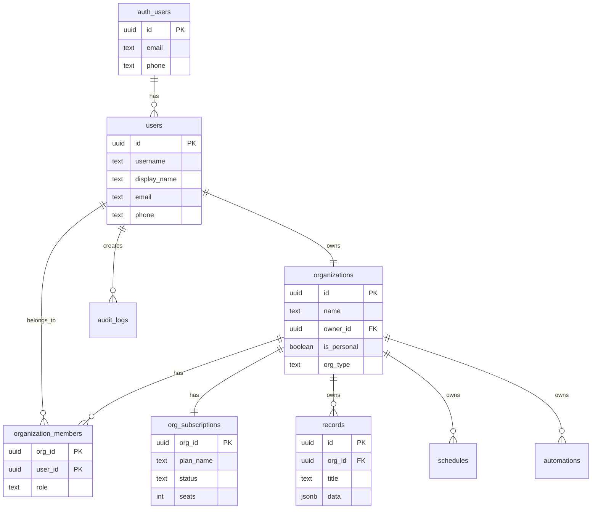
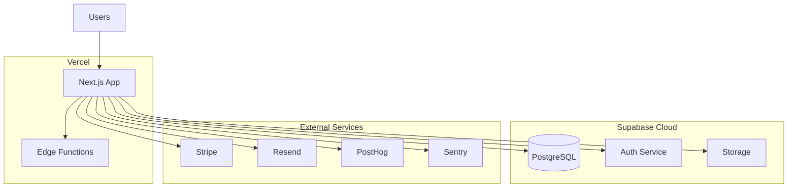

# System Architecture

**LiNKdev Starter Kit - Complete Architecture Overview**

---

## Table of Contents

1. [System Overview](#system-overview)
2. [Technology Stack](#technology-stack)
3. [Architecture Diagrams](#architecture-diagrams)
4. [Component Architecture](#component-architecture)
5. [Data Flow](#data-flow)
6. [Authentication & Authorization](#authentication--authorization)
7. [Billing & Subscriptions](#billing--subscriptions)
8. [Database Architecture](#database-architecture)
9. [API Architecture](#api-architecture)
10. [External Integrations](#external-integrations)

---

## System Overview

The LiNKdev Starter Kit is a **production-ready SaaS starter template** built with modern web technologies. It provides a complete foundation for building multi-tenant, subscription-based applications.

### Key Characteristics

- **Multi-tenant:** Organization-based architecture with RLS (Row Level Security)
- **Subscription-based:** Stripe integration with plan-based feature gating
- **Type-safe:** End-to-end TypeScript with tRPC for API type safety
- **Scalable:** Monorepo structure with shared packages
- **Secure:** Supabase Auth with multiple authentication methods
- **Observable:** Built-in error tracking, analytics, and audit logging

---

## Technology Stack

### Frontend

| Technology | Purpose | Version |
|------------|---------|---------|
| **Next.js** | React framework (App Router) | 14.x |
| **React** | UI library | 18.x |
| **TypeScript** | Type safety | 5.x |
| **Tailwind CSS** | Styling | 3.x |
| **Radix UI** | Headless UI components | Latest |
| **shadcn/ui** | Component library | Latest |
| **React Hook Form** | Form management | Latest |
| **Zod** | Schema validation | Latest |

### Backend

| Technology | Purpose |
|------------|---------|
| **Next.js API Routes** | REST endpoints |
| **tRPC** | Type-safe API layer |
| **Server Actions** | Form mutations |
| **Supabase** | Database & Auth |
| **PostgreSQL** | Database |
| **Stripe** | Payments & subscriptions |

### Infrastructure

| Service | Purpose |
|---------|---------|
| **Vercel** | Hosting & deployment |
| **Supabase** | Database, Auth, Storage |
| **Stripe** | Payment processing |
| **Resend** | Transactional emails |
| **PostHog** | Product analytics |
| **Sentry** | Error tracking |

### Development Tools

| Tool | Purpose |
|------|---------|
| **Turborepo** | Monorepo build system |
| **pnpm** | Package manager |
| **Vitest** | Unit testing |
| **Playwright** | E2E testing |
| **ESLint** | Code linting |
| **Prettier** | Code formatting |

---

## Architecture Diagrams

### High-Level System Architecture



### Monorepo Structure



### Request Flow



---

## Component Architecture

### Frontend Architecture

```
apps/web/src/
├── app/                          # Next.js App Router
│   ├── [locale]/                 # Internationalization
│   │   ├── (marketing)/          # Public pages
│   │   ├── (auth_forms)/         # Auth pages
│   │   ├── (dashboard)/          # Main dashboard
│   │   ├── (app)/                # App features
│   │   ├── (console)/            # Developer console
│   │   └── org/[orgId]/          # Organization pages
│   ├── api/                      # API routes
│   │   ├── trpc/                 # tRPC handler
│   │   ├── webhooks/             # Webhook handlers
│   │   └── v1/                   # REST API v1
│   └── actions/                  # Server Actions
├── components/                   # React components
│   ├── ui/                       # Base UI components
│   ├── forms/                    # Form components
│   ├── console/                  # Console components
│   └── errors/                   # Error boundaries
├── lib/                          # Utilities
│   ├── supabase/                 # Supabase clients
│   ├── stripe/                   # Stripe utilities
│   ├── errors/                   # Error handling
│   └── audit/                    # Audit logging
└── hooks/                        # React hooks
```

### Backend Architecture (tRPC)

```
packages/api/src/
├── routers/                      # tRPC routers
│   ├── organization.ts           # Org management
│   ├── user.ts                   # User management
│   ├── profile.ts                # User profiles
│   ├── billing.ts                # Billing operations
│   ├── team.ts                   # Team management
│   ├── records.ts                # Record CRUD
│   ├── scheduling.ts             # Scheduling
│   ├── automation.ts             # Automations
│   ├── audit.ts                  # Audit logs
│   ├── usage.ts                  # Usage tracking
│   ├── flags.ts                  # Feature flags
│   ├── notifications.ts          # Notifications
│   └── settings.ts               # Settings
├── middleware/                   # tRPC middleware
│   ├── auth.ts                   # Auth middleware
│   ├── rateLimit.ts              # Rate limiting
│   └── logging.ts                # Request logging
├── services/                     # Business logic
│   ├── billing.service.ts        # Billing logic
│   ├── usage.service.ts          # Usage tracking
│   └── feature-flags.service.ts  # Feature flags
└── utils/                        # Utilities
    ├── validation.ts             # Zod schemas
    └── errors.ts                 # Error handling
```

---

## Data Flow

### Authentication Flow



### Subscription Flow



### Feature Gate Flow



---

## Authentication & Authorization

### Authentication Methods

1. **Email/Password** - Traditional email + password
2. **Magic Link** - Passwordless email link
3. **Phone OTP** - SMS verification code
4. **OAuth** - Google, GitHub, etc.

### Authentication Flow

```typescript
// Server-side authentication check
import { createServerClient } from '@/lib/supabase/server';

export default async function ProtectedPage() {
  const supabase = createServerClient();
  const { data: { user } } = await supabase.auth.getUser();
  
  if (!user) {
    redirect('/signin');
  }
  
  // User is authenticated
  return <PageContent user={user} />;
}
```

### Authorization Layers

#### 1. Row Level Security (RLS)

Database-level security enforced by PostgreSQL:

```sql
-- Example RLS policy for records table
CREATE POLICY "Users can view records in their organizations"
ON records FOR SELECT
USING (
  org_id IN (
    SELECT org_id 
    FROM organization_members 
    WHERE user_id = auth.uid()
  )
);
```

#### 2. Organization Membership

Users must be members of an organization to access its data:

```typescript
// Check organization membership
const { data: membership } = await supabase
  .from('organization_members')
  .select('role')
  .eq('org_id', orgId)
  .eq('user_id', user.id)
  .single();

if (!membership) {
  throw new Error('Not a member of this organization');
}
```

#### 3. Role-Based Access Control (RBAC)

Organization roles control permissions:

- **owner** - Full access, can delete organization
- **admin** - Manage members, settings, billing
- **member** - Access features, limited settings
- **viewer** - Read-only access

```typescript
// Check role permission
if (membership.role !== 'owner' && membership.role !== 'admin') {
  throw new Error('Insufficient permissions');
}
```

#### 4. Feature Gating

Subscription plans control feature access:

```typescript
// Check feature access
const { data: subscription } = await supabase
  .from('org_subscriptions')
  .select('plan_name')
  .eq('org_id', orgId)
  .single();

if (subscription.plan_name === 'free') {
  throw new Error('Upgrade to access this feature');
}
```

---

## Billing & Subscriptions

### Billing Architecture

See [BILLING_ARCHITECTURE.md](./BILLING_ARCHITECTURE.md) for complete details.

#### Key Principles

1. **Organization-based billing** - All subscriptions at org level
2. **Multi-tenant** - Users can have multiple subscriptions (personal + team orgs)
3. **Stripe-powered** - Webhooks sync subscription state
4. **Feature-gated** - Plans control access and limits

#### Database Schema



#### Subscription Flow

1. User clicks "Upgrade"
2. Create Stripe Checkout session
3. User completes payment
4. Stripe webhook updates `org_subscriptions`
5. User gains access to paid features

---

## Database Architecture

### Schema Overview



### Key Tables

#### Core Tables

- **auth.users** - Supabase auth users (managed by Supabase)
- **users** - Application user profiles
- **organizations** - Organizations (personal + team)
- **organization_members** - User-organization relationships
- **org_subscriptions** - Organization subscriptions

#### Feature Tables

- **records** - Generic record storage
- **schedules** - Scheduled tasks
- **automations** - Automation workflows
- **audit_logs** - Audit trail
- **usage_events** - Usage tracking
- **feature_flags** - Feature flag overrides

#### Billing Tables

- **billing_customers** - Stripe customer mapping
- **org_subscriptions** - Subscription state
- **plan_features** - Plan limits and features
- **invoices** - Invoice records

### RLS Policies

All tables have Row Level Security enabled:

```sql
-- Enable RLS
ALTER TABLE records ENABLE ROW LEVEL SECURITY;

-- Policy: Users can view records in their organizations
CREATE POLICY "view_org_records" ON records
FOR SELECT USING (
  org_id IN (
    SELECT org_id FROM organization_members 
    WHERE user_id = auth.uid()
  )
);

-- Policy: Users can insert records in their organizations
CREATE POLICY "insert_org_records" ON records
FOR INSERT WITH CHECK (
  org_id IN (
    SELECT org_id FROM organization_members 
    WHERE user_id = auth.uid()
  )
);
```

---

## API Architecture

### API Layers

The application uses **two API patterns**:

1. **tRPC** - Type-safe API for internal use
2. **REST** - Public API for external integrations

### tRPC Architecture

```typescript
// packages/api/src/root.ts
export const appRouter = createTRPCRouter({
  organization: organizationRouter,
  user: userRouter,
  profile: profileRouter,
  billing: billingRouter,
  team: teamRouter,
  records: recordsRouter,
  scheduling: schedulingRouter,
  automation: automationRouter,
  audit: auditRouter,
  usage: usageRouter,
  flags: flagsRouter,
  notifications: notificationsRouter,
  settings: settingsRouter,
});
```

#### tRPC Routers

| Router | Purpose | Procedures |
|--------|---------|------------|
| **organization** | Org management | create, update, delete, list |
| **user** | User management | get, update, search |
| **profile** | User profiles | get, update, updateAvatar |
| **billing** | Billing operations | getSubscription, createCheckout, updateSeats |
| **team** | Team management | invite, remove, updateRole |
| **records** | Record CRUD | create, read, update, delete, list |
| **scheduling** | Scheduling | create, update, delete, list |
| **automation** | Automations | create, update, delete, execute |
| **audit** | Audit logs | list, export |
| **usage** | Usage tracking | track, getStats, export |
| **flags** | Feature flags | get, set, list |
| **notifications** | Notifications | list, markRead, delete |
| **settings** | Settings | get, update |

#### tRPC Middleware

```typescript
// Auth middleware
const enforceUserIsAuthed = t.middleware(({ ctx, next }) => {
  if (!ctx.session?.user) {
    throw new TRPCError({ code: 'UNAUTHORIZED' });
  }
  return next({ ctx: { user: ctx.session.user } });
});

// Rate limit middleware
const rateLimitMiddleware = t.middleware(async ({ ctx, next }) => {
  await checkRateLimit(ctx.user.id);
  return next();
});

// Protected procedure
export const protectedProcedure = t.procedure
  .use(enforceUserIsAuthed)
  .use(rateLimitMiddleware);
```

### REST API

```
/api/v1/
├── records/              # Record CRUD
│   ├── GET /             # List records
│   ├── POST /            # Create record
│   ├── GET /:id          # Get record
│   ├── PATCH /:id        # Update record
│   └── DELETE /:id       # Delete record
├── orgs/                 # Organization management
│   ├── GET /             # List organizations
│   └── POST /            # Create organization
├── billing/              # Billing operations
│   ├── POST /checkout    # Create checkout session
│   └── GET /subscription # Get subscription
└── audit/                # Audit logs
    └── GET /             # List audit logs
```

### Webhooks

```
/api/webhooks/
├── stripe/               # Stripe webhooks
│   └── POST /            # Handle Stripe events
└── [provider]/           # Generic webhook handler
    └── POST /            # Handle provider events
```

---

## External Integrations

### Stripe Integration

**Purpose:** Payment processing and subscription management

**Events Handled:**
- `checkout.session.completed` - New subscription
- `customer.subscription.updated` - Subscription changed
- `customer.subscription.deleted` - Subscription canceled
- `invoice.payment_succeeded` - Payment successful
- `invoice.payment_failed` - Payment failed

**Implementation:**
```typescript
// apps/web/src/app/api/webhooks/stripe/route.ts
export async function POST(req: Request) {
  const signature = req.headers.get('stripe-signature');
  const event = stripe.webhooks.constructEvent(
    await req.text(),
    signature,
    process.env.STRIPE_WEBHOOK_SECRET
  );
  
  switch (event.type) {
    case 'checkout.session.completed':
      await handleCheckoutComplete(event.data.object);
      break;
    // ... other events
  }
  
  return new Response('OK', { status: 200 });
}
```

### Supabase Integration

**Purpose:** Database, authentication, and storage

**Features Used:**
- **Auth** - User authentication and session management
- **Database** - PostgreSQL with RLS
- **Storage** - File uploads and storage
- **Realtime** - Real-time subscriptions (optional)

**Client Types:**
```typescript
// Server-side client (bypasses RLS with service role)
const supabaseAdmin = createClient(
  process.env.SUPABASE_URL,
  process.env.SUPABASE_SERVICE_ROLE_KEY
);

// Server-side client (respects RLS)
const supabase = createServerClient();

// Client-side client
const supabase = createBrowserClient();
```

### Resend Integration

**Purpose:** Transactional email delivery

**Email Types:**
- Welcome emails
- Password reset
- Team invitations
- Billing notifications
- Usage alerts

### PostHog Integration

**Purpose:** Product analytics and feature flags

**Events Tracked:**
- Page views
- User sign ups
- Feature usage
- Subscription changes
- Error occurrences

### Sentry Integration

**Purpose:** Error tracking and monitoring

**Features:**
- Error capture
- Performance monitoring
- Release tracking
- User feedback

---

## Security Considerations

### 1. Authentication Security

- Session-based auth with Supabase
- Secure cookie storage
- CSRF protection
- Rate limiting on auth endpoints

### 2. Authorization Security

- Row Level Security (RLS) on all tables
- Organization-based access control
- Role-based permissions
- Feature gating by subscription

### 3. API Security

- Input validation with Zod
- Rate limiting on all endpoints
- Webhook signature verification
- API key authentication for public API

### 4. Data Security

- Encrypted at rest (Supabase)
- Encrypted in transit (HTTPS)
- Service role key never exposed to client
- Sensitive data in environment variables

### 5. Payment Security

- PCI compliance via Stripe
- No card data stored locally
- Webhook signature verification
- Idempotency keys for payments

---

## Performance Considerations

### 1. Database Optimization

- Indexes on frequently queried columns
- Connection pooling
- Query optimization
- Pagination for large datasets

### 2. Caching Strategy

- React Query for client-side caching
- Next.js static generation where possible
- CDN for static assets
- Database query caching

### 3. Code Splitting

- Route-based code splitting
- Dynamic imports for heavy components
- Lazy loading for non-critical features

### 4. Monitoring

- Performance monitoring with Sentry
- Database query monitoring
- API response time tracking
- Error rate monitoring

---

## Deployment Architecture

### Production Environment



### Deployment Process

1. Push to main branch
2. Vercel builds and deploys
3. Run database migrations (if any)
4. Verify deployment
5. Monitor for errors

---

## Next Steps

- **Project Structure:** [PROJECT_STRUCTURE.md](./PROJECT_STRUCTURE.md)
- **Database Schema:** [DATABASE_SCHEMA.md](./DATABASE_SCHEMA.md)
- **Billing Architecture:** [BILLING_ARCHITECTURE.md](./BILLING_ARCHITECTURE.md)
- **Development Guide:** [../03_DEVELOPMENT/DEVELOPMENT_GUIDE.md](../03_DEVELOPMENT/DEVELOPMENT_GUIDE.md)
- **API Reference:** [../05_API_REFERENCE/API_OVERVIEW.md](../05_API_REFERENCE/API_OVERVIEW.md)

---

**Last Updated:** 2025-12-22
