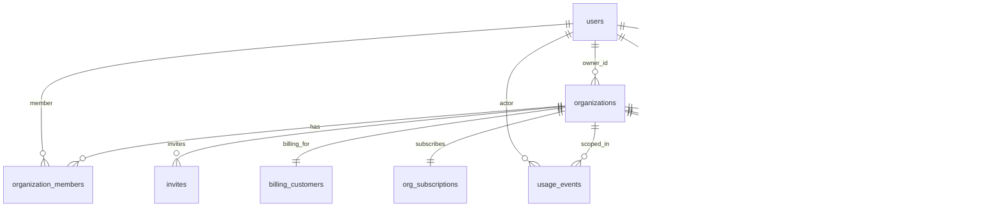

## Database Schema Overview

Postgres schema for LiNKdev Starter Kit (Supabase). Production state is migration-driven (`apps/web/supabase/migrations`); `apps/web/schema.sql` is the reference snapshot.

### Key Entities
- `users`: platform profiles linked to `auth.users`.
- `organizations`: org workspaces, owned by a user; `organization_members` tracks roles.
- `invites`: pending org invitations.
- `billing_customers` / `org_subscriptions`: org-level billing mapping to Stripe.
- `usage_events` / `usage_aggregations`: raw and rolled-up usage metering.
- `audit_logs`: immutable org-scoped activity trail.

### Relationships (ERD)

### Performance Indexes (high value paths)
- Audit logs: `idx_audit_logs_org_actor_created`, `idx_audit_logs_actor_created`, plus org/time/entity/action coverage.
- Usage events: `idx_usage_events_org_event_created`, `idx_usage_events_org_created`, `idx_usage_events_user_type_date`.
- Users: `idx_users_email_lower`, `idx_users_username_lower`, `idx_users_account_type_created` (in addition to email/username/account_type defaults).
- Organization members: `idx_org_members_user_role` (alongside org_id/user_id).
- Supporting: org type, invite status/type, plan_features keys, org_subscriptions stripe ids, processed_events ids, usage aggregation helpers.

### RLS Policy Coverage (summary)
- `users`: select/update self.
- `organizations`: owner select/update/insert; personal-org select by owner; member select; owner-only updates.
- `organization_members`: member select; self-delete; owners/admins add/update/remove roles.
- `invites`: owners/admins manage within org; members can view.
- `billing_customers`, `org_subscriptions`, `processed_events`: members read billing; server-only mutations.
- `usage_events`: insert/select only for matching `user_id`.
- `usage_aggregations`: select if owner of row or member of scoped org.
- `products`, `prices`, `plan_features`: public read.
- `audit_logs`: org members read; server insert; no update/delete (immutable).

### Validation Notes
- Current reference aligns with migrations through `20251215000000__performance_indexes.sql`.
- Supabase CLI not executed in this run; to verify apply state: `supabase db status` and `supabase db diff --linked` (expect no diff after applying new migration).

### Seed Data
- Dev seed script: `apps/web/scripts/seed-dev-data.sql` (idempotent). Inserts 5 users, 3 orgs + memberships, sample usage events, audit logs, and subscriptions using fixed UUIDs/password hashes.
