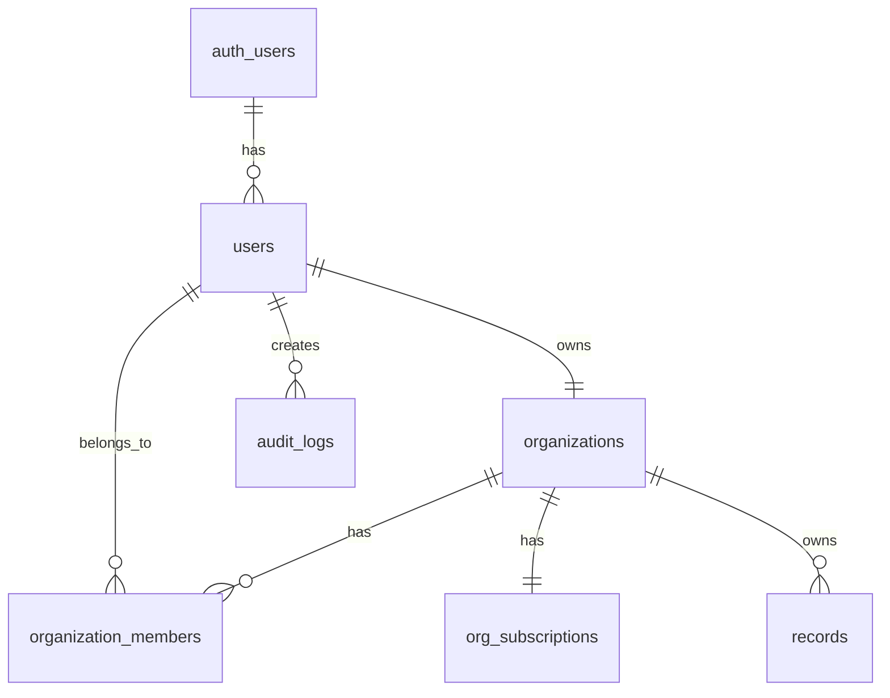

# Database Guide

**Complete guide to database operations in the LiNKdev Starter Kit**

---

## Table of Contents

1. [Overview](#overview)
2. [Schema Overview](#schema-overview)
3. [Migration Workflow](#migration-workflow)
4. [Seeding Data](#seeding-data)
5. [RLS Policies](#rls-policies)
6. [Query Patterns](#query-patterns)
7. [Type Generation](#type-generation)

---

## Overview

The LiNKdev Starter Kit uses **Supabase (PostgreSQL)** with a **cloud-only** policy. No local database instances are allowed for production data.

### Key Principles

1. **Cloud-only** - All database operations use Supabase Cloud
2. **Migration-based** - All schema changes via migrations
3. **RLS-enforced** - Row Level Security on all tables
4. **Type-safe** - Generated TypeScript types from schema
5. **Idempotent seeds** - Safe, repeatable data seeding

---

## Schema Overview

### Core Tables

**Authentication & Users:**
- `auth.users` - Supabase auth users (managed by Supabase)
- `users` - Application user profiles
- `user_preferences` - User settings and preferences

**Organizations:**
- `organizations` - Organizations (personal + team)
- `organization_members` - User-organization relationships
- `organization_invitations` - Pending invitations

**Billing & Subscriptions:**
- `billing_customers` - Stripe customer mapping
- `org_subscriptions` - Organization subscriptions
- `plan_features` - Plan limits and features
- `invoices` - Invoice records

**Features:**
- `records` - Generic record storage
- `schedules` - Scheduled tasks
- `automations` - Automation workflows
- `audit_logs` - Audit trail
- `usage_events` - Usage tracking
- `feature_flags` - Feature flag overrides

### Entity Relationships



For complete schema details, see [DATABASE_SCHEMA.md](../02_ARCHITECTURE/DATABASE_SCHEMA.md).

---

## Migration Workflow

### Cloud-Only Policy

**Prohibited Commands:**
```bash
# ❌ NEVER RUN THESE
supabase start
supabase stop
supabase db reset
supabase db push  # (unless targeting cloud)
```

**Allowed Operations:**
```bash
# ✅ USE THESE INSTEAD
# MCP tools for migrations (preferred)
# Supabase Dashboard SQL Editor
# Cloud-linked CLI
```

### Creating a Migration

**1. Create migration file:**

```bash
# Format: YYYYMMDDHHMMSS_description.sql
# Example: 20251222120000_add_user_preferences.sql
```

**2. Write migration SQL:**

```sql
-- apps/web/supabase/migrations/20251222120000_add_user_preferences.sql

-- Create table
CREATE TABLE IF NOT EXISTS public.user_preferences (
  id UUID PRIMARY KEY DEFAULT gen_random_uuid(),
  user_id UUID NOT NULL REFERENCES auth.users(id) ON DELETE CASCADE,
  theme TEXT DEFAULT 'system',
  language TEXT DEFAULT 'en',
  notifications_enabled BOOLEAN DEFAULT true,
  created_at TIMESTAMPTZ DEFAULT NOW(),
  updated_at TIMESTAMPTZ DEFAULT NOW(),
  UNIQUE(user_id)
);

-- Enable RLS
ALTER TABLE public.user_preferences ENABLE ROW LEVEL SECURITY;

-- RLS Policies
CREATE POLICY "Users can view own preferences"
ON public.user_preferences FOR SELECT
USING (auth.uid() = user_id);

CREATE POLICY "Users can update own preferences"
ON public.user_preferences FOR UPDATE
USING (auth.uid() = user_id);

CREATE POLICY "Users can insert own preferences"
ON public.user_preferences FOR INSERT
WITH CHECK (auth.uid() = user_id);

-- Indexes
CREATE INDEX idx_user_preferences_user_id ON public.user_preferences(user_id);

-- Updated at trigger
CREATE TRIGGER update_user_preferences_updated_at
BEFORE UPDATE ON public.user_preferences
FOR EACH ROW EXECUTE FUNCTION update_updated_at_column();
```

**3. Apply migration via MCP:**

```
call SupabaseMCP.executeSQL
```

Or use Supabase Dashboard:
1. Go to SQL Editor
2. Paste migration SQL
3. Click "Run"

**4. Verify migration:**

```sql
-- Check table exists
SELECT * FROM information_schema.tables
WHERE table_schema = 'public'
AND table_name = 'user_preferences';

-- Check RLS is enabled
SELECT tablename, rowsecurity
FROM pg_tables
WHERE schemaname = 'public'
AND tablename = 'user_preferences';
```

**5. Generate TypeScript types:**

```bash
pnpm --filter ./apps/web supabase:types
```

### Migration Best Practices

**Do's:**
- ✅ Use `IF NOT EXISTS` for idempotency
- ✅ Include rollback instructions in comments
- ✅ Test on development database first
- ✅ Add indexes for foreign keys
- ✅ Enable RLS on all tables
- ✅ Document breaking changes

**Don'ts:**
- ❌ Don't run destructive operations in production
- ❌ Don't skip RLS policies
- ❌ Don't forget to generate types after migration
- ❌ Don't modify existing migrations (create new ones)

---

## Seeding Data

### Idempotent Seed Pattern

```sql
-- apps/web/supabase/seeds/demo_data.sql

-- Insert demo organization
INSERT INTO public.organizations (id, name, slug, org_type, is_personal, created_at)
VALUES (
  '00000000-0000-0000-0000-000000000001',
  'Demo Organization',
  'demo-org',
  'business',
  false,
  NOW()
)
ON CONFLICT (id) DO NOTHING;

-- Insert demo users
INSERT INTO public.users (id, username, email, display_name, created_at)
VALUES 
  (
    '00000000-0000-0000-0000-000000000001',
    'demo_admin',
    'admin@demo.com',
    'Demo Admin',
    NOW()
  ),
  (
    '00000000-0000-0000-0000-000000000002',
    'demo_user',
    'user@demo.com',
    'Demo User',
    NOW()
  )
ON CONFLICT (id) DO NOTHING;

-- Add users to organization
INSERT INTO public.organization_members (org_id, user_id, role, created_at)
VALUES 
  (
    '00000000-0000-0000-0000-000000000001',
    '00000000-0000-0000-0000-000000000001',
    'owner',
    NOW()
  ),
  (
    '00000000-0000-0000-0000-000000000001',
    '00000000-0000-0000-0000-000000000002',
    'member',
    NOW()
  )
ON CONFLICT (org_id, user_id) DO NOTHING;
```

### Executing Seeds

**Via MCP:**
```
call SupabaseMCP.executeSQL
```

**Via Dashboard:**
1. Go to SQL Editor
2. Paste seed SQL
3. Click "Run"

### Seed Best Practices

- Use `ON CONFLICT DO NOTHING` for idempotency
- Use UUIDs for all primary keys
- Include `created_at` timestamps
- Test seeds in development first
- Keep seeds minimal and focused
- Never use `TRUNCATE` or `DELETE` without `WHERE`

---

## RLS Policies

### Policy Patterns

**1. User can access own data:**

```sql
CREATE POLICY "Users can view own records"
ON public.user_data FOR SELECT
USING (auth.uid() = user_id);
```

**2. Organization members can access org data:**

```sql
CREATE POLICY "Org members can view org records"
ON public.records FOR SELECT
USING (
  org_id IN (
    SELECT org_id
    FROM public.organization_members
    WHERE user_id = auth.uid()
  )
);
```

**3. Role-based access:**

```sql
CREATE POLICY "Only admins can delete"
ON public.records FOR DELETE
USING (
  EXISTS (
    SELECT 1
    FROM public.organization_members
    WHERE org_id = records.org_id
    AND user_id = auth.uid()
    AND role IN ('owner', 'admin')
  )
);
```

**4. Public read, authenticated write:**

```sql
-- Public read
CREATE POLICY "Anyone can view"
ON public.posts FOR SELECT
USING (true);

-- Authenticated write
CREATE POLICY "Authenticated users can insert"
ON public.posts FOR INSERT
WITH CHECK (auth.uid() IS NOT NULL);
```

### Testing RLS Policies

```sql
-- Test as specific user
SET LOCAL role TO authenticated;
SET LOCAL request.jwt.claims TO '{"sub": "user-uuid-here"}';

-- Run queries to test access
SELECT * FROM public.records;

-- Reset
RESET role;
```

---

## Query Patterns

### Basic Queries

**Select with RLS:**
```typescript
const { data, error } = await supabase
  .from('records')
  .select('*')
  .eq('org_id', orgId);
```

**Insert:**
```typescript
const { data, error } = await supabase
  .from('records')
  .insert({
    title: 'New Record',
    org_id: orgId,
  })
  .select()
  .single();
```

**Update:**
```typescript
const { data, error } = await supabase
  .from('records')
  .update({ title: 'Updated Title' })
  .eq('id', recordId)
  .select()
  .single();
```

**Delete:**
```typescript
const { error } = await supabase
  .from('records')
  .delete()
  .eq('id', recordId);
```

### Advanced Queries

**Joins:**
```typescript
const { data } = await supabase
  .from('records')
  .select(`
    *,
    organization:organizations(name, slug),
    creator:users(username, display_name)
  `)
  .eq('org_id', orgId);
```

**Filtering:**
```typescript
const { data } = await supabase
  .from('records')
  .select('*')
  .eq('org_id', orgId)
  .ilike('title', '%search%')
  .gte('created_at', startDate)
  .lte('created_at', endDate)
  .order('created_at', { ascending: false })
  .limit(10);
```

**Pagination:**
```typescript
const { data, count } = await supabase
  .from('records')
  .select('*', { count: 'exact' })
  .eq('org_id', orgId)
  .range(0, 9);  // First 10 records
```

### Using RPC Functions

```typescript
const { data } = await supabase.rpc('check_feature_access', {
  p_user_id: user.id,
  p_feature_key: 'max_records',
  p_org_id: orgId,
});
```

---

## Type Generation

### Generate Types from Schema

```bash
# Generate types
pnpm --filter ./apps/web supabase:types

# Output: apps/web/src/types/supabase.ts
```

### Using Generated Types

```typescript
import { Database } from '@/types/supabase';

type Record = Database['public']['Tables']['records']['Row'];
type RecordInsert = Database['public']['Tables']['records']['Insert'];
type RecordUpdate = Database['public']['Tables']['records']['Update'];

// Use in functions
async function getRecord(id: string): Promise<Record | null> {
  const { data } = await supabase
    .from('records')
    .select('*')
    .eq('id', id)
    .single();
  
  return data;
}
```

### Type-Safe Queries

```typescript
const { data } = await supabase
  .from('records')
  .select('id, title, created_at')
  .eq('org_id', orgId);

// TypeScript knows the shape of data:
// { id: string; title: string; created_at: string; }[]
```

---

## Troubleshooting

### Migration Failed

**Check for:**
- Syntax errors in SQL
- Missing dependencies (referenced tables)
- Conflicting constraints
- RLS policy errors

**Solution:**
1. Review error message
2. Fix SQL in migration file
3. Create new migration with fix
4. Apply new migration

### RLS Blocking Queries

**Check:**
```sql
-- Verify RLS is enabled
SELECT tablename, rowsecurity
FROM pg_tables
WHERE schemaname = 'public';

-- Check policies
SELECT * FROM pg_policies
WHERE schemaname = 'public'
AND tablename = 'your_table';
```

**Solution:**
- Verify user is authenticated
- Check policy conditions
- Test with service role key (bypasses RLS)

### Type Generation Failed

**Check:**
- Supabase CLI is installed
- Project is linked to cloud
- Database is accessible
- No syntax errors in schema

**Solution:**
```bash
# Reinstall CLI
npm install -g supabase

# Re-link project
supabase link --project-ref <project-ref>

# Regenerate types
pnpm --filter ./apps/web supabase:types
```

---

## Next Steps

- **Database Schema:** [../02_ARCHITECTURE/DATABASE_SCHEMA.md](../02_ARCHITECTURE/DATABASE_SCHEMA.md)
- **Development Guide:** [DEVELOPMENT_GUIDE.md](./DEVELOPMENT_GUIDE.md)
- **MCP Integration:** [MCP_INTEGRATION.md](./MCP_INTEGRATION.md)
- **Troubleshooting:** [TROUBLESHOOTING.md](./TROUBLESHOOTING.md)

---

**Last Updated:** 2025-12-22
