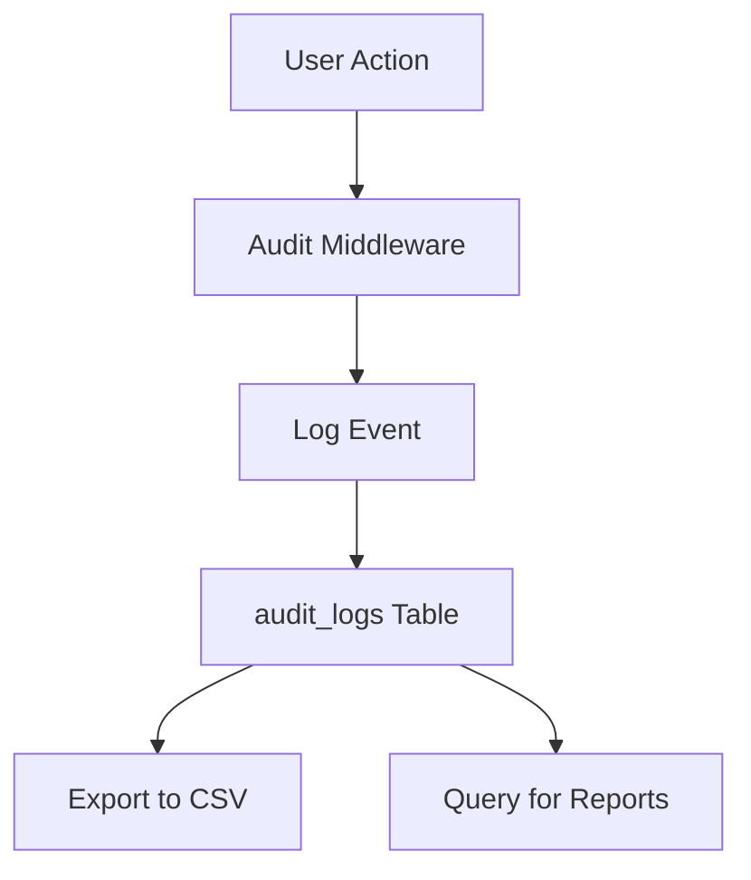

# Audit Logs

**Complete guide to audit logging and compliance in the LTM Starter Kit**

---

## Table of Contents

1. [Overview](#overview)
2. [Architecture](#architecture)
3. [Audited Operations](#audited-operations)
4. [Querying Audit Logs](#querying-audit-logs)
5. [Log Rotation](#log-rotation)
6. [Monitoring](#monitoring)
7. [GDPR Compliance](#gdpr-compliance)
8. [Exporting Audit Data](#exporting-audit-data)
9. [Troubleshooting](#troubleshooting)

---

## Overview

Audit logging captures create/update/delete/role-change actions for org-scoped resources plus user profile changes when an org context is present. This provides:

- **Compliance** - Track all changes for regulatory requirements
- **Security** - Monitor suspicious activity and unauthorized access
- **Accountability** - Know who did what and when
- **Debugging** - Troubleshoot issues by reviewing audit trail

### Key Concepts

- **Audit Events** - Individual actions logged in real-time
- **Actor** - User who performed the action
- **Entity** - Resource that was modified
- **Metadata** - Additional context about the action

---

## Architecture

### Audit Flow



### Database Schema

```sql
audit_logs (
  id uuid PRIMARY KEY,
  org_id uuid REFERENCES organizations,
  actor_id uuid REFERENCES auth.users NOT NULL,
  entity_type text NOT NULL,
  entity_id uuid,
  action text NOT NULL,
  metadata jsonb DEFAULT '{}',
  created_at timestamptz DEFAULT now()
)

-- Indexes for performance
CREATE INDEX idx_audit_logs_org_id ON audit_logs(org_id);
CREATE INDEX idx_audit_logs_entity ON audit_logs(entity_type, entity_id);
CREATE INDEX idx_audit_logs_action ON audit_logs(action);
CREATE INDEX idx_audit_logs_created_at ON audit_logs(created_at);
```

---

## Audited Operations

### 23 Operations Across 6 Routers

**Organization (6 operations):**
- `create` - Organization created
- `update` - Organization updated
- `delete` - Organization deleted
- `addMember` - Member added to organization
- `removeMember` - Member removed from organization
- `updateMemberRole` - Member role changed

**Records (6 operations):**
- `create_record_type` - Record type created
- `update_record_type` - Record type updated
- `delete_record_type` - Record type deleted
- `create_record` - Record created
- `update_record` - Record updated
- `delete_record` - Record deleted

**Scheduling (6 operations):**
- `create_reminder` - Reminder created
- `update_reminder` - Reminder updated
- `delete_reminder` - Reminder deleted
- `create_schedule` - Schedule created
- `update_schedule` - Schedule updated
- `delete_schedule` - Schedule deleted

**Billing (2 operations):**
- `createCheckout` - Checkout session created
- `simulateEvent` - Event simulated (offline mode)

**Automation (1 operation):**
- `enqueue` - Automation enqueued

**User (2 operations):**
- `updateProfile` - User profile updated (when org context present)
- `deleteAccount` - User account deleted

---

## Querying Audit Logs

### Common Patterns

**Filter by Organization:**

```typescript
const { data: logs } = await supabase
  .from('audit_logs')
  .select('*')
  .eq('org_id', orgId)
  .order('created_at', { ascending: false })
  .limit(100);
```

**Filter by Entity:**

```typescript
// Recent changes for a specific record
const { data: logs } = await supabase
  .from('audit_logs')
  .select('*')
  .eq('org_id', orgId)
  .eq('entity_type', 'record')
  .eq('entity_id', recordId)
  .order('created_at', { ascending: false });
```

**Filter by Action:**

```typescript
// Who changed roles last week
const { data: logs } = await supabase
  .from('audit_logs')
  .select('actor_id, created_at, metadata')
  .eq('org_id', orgId)
  .eq('action', 'role_changed')
  .gte('created_at', new Date(Date.now() - 7 * 24 * 60 * 60 * 1000).toISOString());
```

**Filter by Date Range:**

```typescript
const startDate = new Date('2025-01-01');
const endDate = new Date('2025-01-31');

const { data: logs } = await supabase
  .from('audit_logs')
  .select('*')
  .eq('org_id', orgId)
  .gte('created_at', startDate.toISOString())
  .lte('created_at', endDate.toISOString());
```

**Free-text Search in Metadata:**

```typescript
// Search metadata JSONB field
const { data: logs } = await supabase
  .from('audit_logs')
  .select('*')
  .eq('org_id', orgId)
  .textSearch('metadata', 'search term');
```

### Pagination

**Cursor-based Pagination:**

```typescript
async function getAuditLogs(
  orgId: string,
  cursor?: string,
  limit: number = 50
) {
  let query = supabase
    .from('audit_logs')
    .select('*')
    .eq('org_id', orgId)
    .order('created_at', { ascending: false })
    .limit(limit + 1); // Fetch one extra to check for next page

  if (cursor) {
    query = query.lt('created_at', cursor);
  }

  const { data: logs } = await query;

  const hasMore = logs.length > limit;
  const nextCursor = hasMore ? logs[limit - 1].created_at : null;

  return {
    logs: logs.slice(0, limit),
    nextCursor,
    hasMore,
  };
}
```

---

## Log Rotation

### Retention Policy

**Recommended retention: 90 days**

```sql
-- Cleanup old logs
DELETE FROM audit_logs 
WHERE created_at < NOW() - INTERVAL '90 days';
```

### Automated Cleanup

**Cron Job Example (daily at 02:15):**

```bash
# Add to crontab
15 2 * * * psql "$DATABASE_URL" -c "DELETE FROM audit_logs WHERE created_at < NOW() - INTERVAL '90 days';"
```

**Vercel Cron Configuration:**

```json
{
  "crons": [
    {
      "path": "/api/cron/cleanup-audit-logs",
      "schedule": "15 2 * * *"
    }
  ]
}
```

**API Route:**

```typescript
// app/api/cron/cleanup-audit-logs/route.ts
export async function GET(request: Request) {
  // Verify cron secret
  if (request.headers.get('authorization') !== `Bearer ${process.env.CRON_SECRET}`) {
    return new Response('Unauthorized', { status: 401 });
  }

  const { error } = await supabaseAdmin
    .from('audit_logs')
    .delete()
    .lt('created_at', new Date(Date.now() - 90 * 24 * 60 * 60 * 1000).toISOString());

  if (error) {
    return new Response(`Error: ${error.message}`, { status: 500 });
  }

  return new Response('Audit logs cleaned up', { status: 200 });
}
```

---

## Monitoring

### Setup

**Insertion failures:** Alert on Supabase function errors or tRPC responses where `audit.append` fails.

**Table growth:** Track `pg_total_relation_size('audit_logs')`; alert when exceeding threshold (e.g., 10 GB) or slope change >25% week-over-week.

**Throughput/perf:** Monitor insert latency and RPC response times for `get_audit_stats`.

### Sample Queries

**Size in MB:**

```sql
SELECT pg_total_relation_size('audit_logs') / 1024 / 1024 AS size_mb;
```

**Failed inserts in last 24h:**

```sql
-- Assuming errors captured in separate table
SELECT count(*) FROM audit_logs_errors 
WHERE occurred_at > NOW() - INTERVAL '1 day';
```

**Daily volume by action:**

```sql
SELECT 
  action, 
  date_trunc('day', created_at) AS day, 
  count(*)
FROM audit_logs
GROUP BY action, day
ORDER BY day DESC;
```

**Top actors:**

```sql
SELECT 
  actor_id, 
  count(*) AS action_count
FROM audit_logs
WHERE org_id = 'org-uuid'
  AND created_at > NOW() - INTERVAL '7 days'
GROUP BY actor_id
ORDER BY action_count DESC
LIMIT 10;
```

---

## GDPR Compliance

### Retention

Enforce 90-day purge (see Log Rotation section).

### User Deletion

When users request erasure, remove PII from `metadata` or anonymize `actor_id` where required by policy:

```sql
-- Anonymize actor_id for deleted users
UPDATE audit_logs
SET actor_id = '00000000-0000-0000-0000-000000000000',
    metadata = metadata - 'email' - 'name'
WHERE actor_id = 'deleted-user-id';
```

### Anonymization

Consider hashing actor IDs for exports that leave the control plane:

```typescript
import crypto from 'crypto';

function hashActorId(actorId: string): string {
  return crypto.createHash('sha256').update(actorId).digest('hex');
}
```

### Export

Provide CSV via `audit.exportCsv` for DSAR/subject access requests; scope by org and date window:

```typescript
// Export audit logs for GDPR request
export async function exportAuditLogs(
  orgId: string,
  startDate: Date,
  endDate: Date
) {
  const { data: logs } = await supabase
    .from('audit_logs')
    .select('*')
    .eq('org_id', orgId)
    .gte('created_at', startDate.toISOString())
    .lte('created_at', endDate.toISOString());

  // Convert to CSV
  const csv = logs.map(log => ({
    timestamp: log.created_at,
    actor: log.actor_id,
    action: log.action,
    entity: `${log.entity_type}:${log.entity_id}`,
    metadata: JSON.stringify(log.metadata),
  }));

  return csv;
}
```

### Org-level Requests

Confirm org ownership before exporting or deleting data:

```typescript
async function exportOrgAuditLogs(
  userId: string,
  orgId: string,
  startDate: Date,
  endDate: Date
) {
  // Verify user owns the org
  const { data: membership } = await supabase
    .from('organization_members')
    .select('role')
    .eq('user_id', userId)
    .eq('org_id', orgId)
    .eq('role', 'owner')
    .single();

  if (!membership) {
    throw new Error('Only org owners can export audit logs');
  }

  return exportAuditLogs(orgId, startDate, endDate);
}
```

---

## Exporting Audit Data

### CSV Export

```typescript
// app/api/audit/export/route.ts
import { requireAuth } from '@/lib/auth/server';
import { exportAuditLogs } from '@/lib/audit/export';

export async function GET(request: Request) {
  const user = await requireAuth();
  const { searchParams } = new URL(request.url);
  
  const orgId = searchParams.get('orgId');
  const startDate = new Date(searchParams.get('startDate') || '2025-01-01');
  const endDate = new Date(searchParams.get('endDate') || '2025-12-31');

  // Verify access
  const hasAccess = await hasOrgAccess(user.id, orgId);
  if (!hasAccess) {
    return new Response('Access denied', { status: 403 });
  }

  const logs = await exportAuditLogs(orgId, startDate, endDate);

  // Convert to CSV
  const csv = [
    'Timestamp,Actor,Action,Entity,Metadata',
    ...logs.map(log => 
      `${log.created_at},${log.actor_id},${log.action},${log.entity_type}:${log.entity_id},"${JSON.stringify(log.metadata)}"`
    )
  ].join('\n');

  return new Response(csv, {
    headers: {
      'Content-Type': 'text/csv',
      'Content-Disposition': `attachment; filename="audit-logs-${orgId}-${Date.now()}.csv"`,
    },
  });
}
```

### tRPC Procedure

```typescript
// packages/api/src/routers/audit.ts
export const auditRouter = createTRPCRouter({
  exportCsv: protectedProcedure
    .input(z.object({
      orgId: z.string(),
      startDate: z.date(),
      endDate: z.date(),
    }))
    .query(async ({ input, ctx }) => {
      // Verify access
      const hasAccess = await hasOrgAccess(ctx.user.id, input.orgId);
      if (!hasAccess) {
        throw new TRPCError({
          code: 'FORBIDDEN',
          message: 'Access denied',
        });
      }

      return exportAuditLogs(input.orgId, input.startDate, input.endDate);
    }),
});
```

---

## Troubleshooting

### Issue: No logs created

**Check:**
1. Middleware is attached?
2. `NEXT_PUBLIC_SUPABASE_URL` configured?
3. Supabase service role permissions correct?

**Debug:**

```sql
-- Check recent logs
SELECT * FROM audit_logs 
ORDER BY created_at DESC 
LIMIT 10;

-- Check if middleware is running
SELECT count(*) FROM audit_logs 
WHERE created_at > NOW() - INTERVAL '1 hour';
```

### Issue: Missing orgId

**Check:**
1. Audit middleware requires org context?
2. Client passes `orgId`?
3. Access guards populate context?

**Debug:**

```sql
-- Check logs without org_id
SELECT * FROM audit_logs 
WHERE org_id IS NULL;

-- Check logs with org_id
SELECT count(*) FROM audit_logs 
WHERE org_id IS NOT NULL;
```

### Issue: CSV export empty

**Check:**
1. Filters (`entity_type`, `action`, dates) correct?
2. At least one log matches?
3. Date range valid?

**Debug:**

```sql
-- Test query
SELECT count(*) FROM audit_logs
WHERE org_id = 'org-uuid'
  AND entity_type = 'record'
  AND action = 'create'
  AND created_at >= '2025-01-01'
  AND created_at <= '2025-01-31';
```

### Issue: Coverage gaps

**Check:**
1. New mutations wrap with `createAuditMiddleware`?
2. Specialized audit helpers used?
3. All operations covered?

**Debug:**

```sql
-- Check which actions are logged
SELECT DISTINCT action FROM audit_logs;

-- Check which entity types are logged
SELECT DISTINCT entity_type FROM audit_logs;
```

### Known Limitations

**User-Level Audit Logs**

**Limitation:** User profile updates are only audited when the user is in an organization context (orgId available). Profile changes outside of an org context are not currently logged.

**Impact:** Personal profile updates by users not in any organization won't appear in audit logs.

**Workaround:** Most users will be in at least one organization (personal org created during onboarding), so this affects a small subset of users.

**Future Enhancement:** Consider implementing a separate `user_audit_logs` table for user-level actions that aren't org-scoped.

---

## Related Documentation

- **Permissions:** [PERMISSIONS.md](./PERMISSIONS.md)
- **Organizations:** [ORGANIZATIONS.md](./ORGANIZATIONS.md)
- **Development Guide:** [../03_DEVELOPMENT/DEVELOPMENT_GUIDE.md](../03_DEVELOPMENT/DEVELOPMENT_GUIDE.md)

---

**Last Updated:** 2025-01-27
