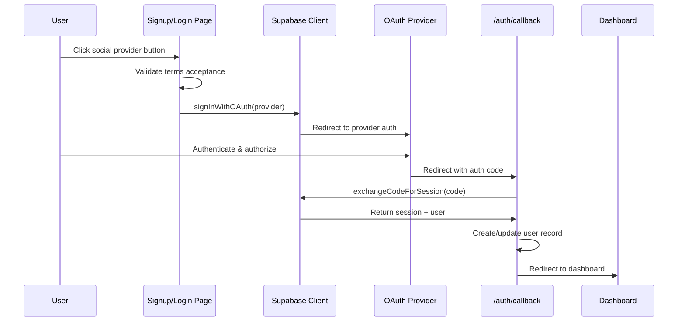

# Authentication

**Complete guide to authentication in the LiNKdev Starter Kit**

---

## Table of Contents

1. [Overview](#overview)
2. [Authentication Methods](#authentication-methods)
3. [OAuth Providers](#oauth-providers)
4. [Magic Links](#magic-links)
5. [Phone OTP](#phone-otp)
6. [Session Management](#session-management)
7. [Route Protection](#route-protection)
8. [Password Reset](#password-reset)
9. [Implementation Examples](#implementation-examples)
10. [Troubleshooting](#troubleshooting)

---

## Overview

The LiNKdev Starter Kit uses **Supabase Auth** for authentication, providing multiple authentication methods:

- **Social OAuth** - Google, Apple, Microsoft
- **Email Magic Links** - Passwordless email authentication
- **Phone OTP** - SMS-based one-time password
- **Password Authentication** - Traditional email/password

All authentication flows include:
- Comprehensive error handling
- Rate limiting protection
- Session persistence
- Automatic token refresh
- Route protection middleware

---

## Authentication Methods

### Supported Methods

| Method | Provider | Use Case |
|--------|----------|----------|
| **OAuth** | Google, Apple, Microsoft | Quick social login |
| **Magic Link** | Email | Passwordless authentication |
| **OTP** | SMS (Twilio) | Mobile-first authentication |
| **Password** | Email/Password | Traditional authentication |

### Choosing a Method

**Use OAuth when:**
- Users prefer social login
- You want to reduce friction
- You need profile data from providers

**Use Magic Links when:**
- Users don't want to remember passwords
- Security is a priority (no password storage)
- Email verification is required

**Use OTP when:**
- Mobile-first application
- Phone verification is required
- Users prefer SMS over email

**Use Password when:**
- Traditional authentication expected
- Users prefer password-based auth
- Integration with existing systems

---

## OAuth Providers

### Supported Providers

1. **Google OAuth** (`provider: 'google'`)
2. **Apple OAuth** (`provider: 'apple'`)
3. **Microsoft OAuth** (`provider: 'azure'`)

### Setup

**1. Configure Provider in Supabase Dashboard:**

1. Go to Authentication → Providers
2. Enable desired provider
3. Add OAuth credentials:
   - **Google**: Client ID and Secret
   - **Apple**: Service ID, Team ID, Key ID, Private Key
   - **Microsoft**: Application (client) ID and Secret

**2. Set Redirect URL:**

```
https://yourdomain.com/auth/callback
```

**3. Environment Variables:**

```bash
# Already configured via Supabase
NEXT_PUBLIC_SUPABASE_URL=your_supabase_url
NEXT_PUBLIC_SUPABASE_ANON_KEY=your_anon_key
```

### Implementation

**Client-Side OAuth Flow:**

```tsx
'use client';

import { signInWithOAuth } from '@/utils/auth-helpers/client';

export function OAuthButton({ provider }: { provider: 'google' | 'apple' | 'azure' }) {
  const [loading, setLoading] = useState(false);

  const handleOAuth = async () => {
    setLoading(true);
    
    try {
      const { error } = await signInWithOAuth({
        provider,
        options: {
          redirectTo: `${window.location.origin}/auth/callback`,
        },
      });

      if (error) {
        console.error('OAuth error:', error);
        // Error handling UI
      }
    } catch (err) {
      console.error('OAuth failed:', err);
    } finally {
      setLoading(false);
    }
  };

  return (
    <button 
      onClick={handleOAuth} 
      disabled={loading}
      className="w-full"
    >
      {loading ? 'Connecting...' : `Continue with ${provider}`}
    </button>
  );
}
```

**OAuth Flow Architecture:**



### Error Handling

**Common OAuth Errors:**

```typescript
// Error types
type OAuthError = 
  | 'user_cancelled'      // User closed OAuth popup
  | 'provider_error'      // OAuth provider issues
  | 'network_error'       // Connection problems
  | 'rate_limit'          // Too many attempts
  | 'invalid_session'      // Session expired/invalid
  | 'configuration_error' // Missing env vars
  | 'unknown_error';      // Unexpected errors

// Error handling example
try {
  await signInWithOAuth({ provider: 'google' });
} catch (error) {
  if (error.message.includes('cancelled')) {
    // User cancelled - no action needed
  } else if (error.message.includes('rate limit')) {
    // Show rate limit message with countdown
  } else {
    // Show generic error message
  }
}
```

---

## Magic Links

### Overview

Magic links provide passwordless authentication via email. Users receive a link that automatically signs them in when clicked.

### Implementation

**1. Send Magic Link:**

```tsx
'use client';

import { signInWithMagicLink } from '@/utils/auth-helpers/client';

export function MagicLinkForm() {
  const [email, setEmail] = useState('');
  const [loading, setLoading] = useState(false);
  const [sent, setSent] = useState(false);

  const handleSubmit = async (e: React.FormEvent) => {
    e.preventDefault();
    setLoading(true);

    try {
      const { error } = await signInWithMagicLink({
        email,
        options: {
          emailRedirectTo: `${window.location.origin}/auth/callback`,
        },
      });

      if (error) throw error;

      setSent(true);
    } catch (error) {
      console.error('Magic link error:', error);
      // Show error message
    } finally {
      setLoading(false);
    }
  };

  if (sent) {
    return (
      <div>
        <h2>Check your email</h2>
        <p>We sent a magic link to {email}</p>
        <p>Click the link to sign in.</p>
      </div>
    );
  }

  return (
    <form onSubmit={handleSubmit}>
      <input
        type="email"
        value={email}
        onChange={(e) => setEmail(e.target.value)}
        placeholder="Enter your email"
        required
      />
      <button type="submit" disabled={loading}>
        {loading ? 'Sending...' : 'Send Magic Link'}
      </button>
    </form>
  );
}
```

**2. Magic Link Verification Page:**

```tsx
// apps/web/src/app/[locale]/(auth_forms)/magic_link/page.tsx
'use client';

import { useEffect, useState } from 'react';
import { useRouter, useSearchParams } from 'next/navigation';
import { getClient } from '@/lib/supabase/client';

export default function MagicLinkPage() {
  const router = useRouter();
  const searchParams = useSearchParams();
  const token = searchParams.get('token');
  const expires = searchParams.get('expires');

  const [status, setStatus] = useState<'verifying' | 'success' | 'expired' | 'invalid'>('verifying');

  useEffect(() => {
    const checkAuth = async () => {
      const supabase = getClient();
      const { data: { session }, error } = await supabase.auth.getSession();
      
      if (session) {
        setStatus('success');
        setTimeout(() => router.push('/dashboard'), 2000);
      } else if (error?.message.includes('expired')) {
        setStatus('expired');
      } else {
        setStatus('invalid');
      }
    };
    
    checkAuth();
  }, [router]);

  // Render status UI
  return (
    <div>
      {status === 'verifying' && <p>Verifying...</p>}
      {status === 'success' && <p>Success! Redirecting...</p>}
      {status === 'expired' && <p>Link expired. Please request a new one.</p>}
      {status === 'invalid' && <p>Invalid link. Please try again.</p>}
    </div>
  );
}
```

**User Flow:**

1. User enters email on signup/login page
2. System validates email format
3. Supabase sends magic link to user's email
4. User sees "Check your email" confirmation
5. User clicks link in email
6. Callback route exchanges code for session
7. User redirected to dashboard (or onboarding if new)

---

## Phone OTP

### Overview

Phone OTP authentication uses SMS to send a one-time password code. Users enter the code to complete authentication.

### Implementation

**1. Send OTP:**

```tsx
'use client';

import { signInWithOTP } from '@/utils/auth-helpers/client';

export function PhoneOTPForm() {
  const [phone, setPhone] = useState('');
  const [countryCode, setCountryCode] = useState('+1');
  const [loading, setLoading] = useState(false);

  const handleSubmit = async (e: React.FormEvent) => {
    e.preventDefault();
    setLoading(true);

    try {
      const fullPhone = `${countryCode}${phone}`;
      
      const { error } = await signInWithOTP({
        phone: fullPhone,
        options: {
          channel: 'sms',
        },
      });

      if (error) throw error;

      // Redirect to OTP verification page
      router.push(`/verify_otp?phone=${encodeURIComponent(fullPhone)}`);
    } catch (error) {
      console.error('OTP error:', error);
      // Show error message
    } finally {
      setLoading(false);
    }
  };

  return (
    <form onSubmit={handleSubmit}>
      <select value={countryCode} onChange={(e) => setCountryCode(e.target.value)}>
        <option value="+1">US (+1)</option>
        <option value="+44">UK (+44)</option>
        {/* More options */}
      </select>
      <input
        type="tel"
        value={phone}
        onChange={(e) => setPhone(e.target.value)}
        placeholder="Phone number"
        required
      />
      <button type="submit" disabled={loading}>
        {loading ? 'Sending...' : 'Send Code'}
      </button>
    </form>
  );
}
```

**2. Verify OTP:**

```tsx
// apps/web/src/app/[locale]/(auth_forms)/verify_otp/page.tsx
'use client';

import { useState } from 'react';
import { useRouter, useSearchParams } from 'next/navigation';
import { getClient } from '@/lib/supabase/client';

export default function VerifyOTPPage() {
  const router = useRouter();
  const searchParams = useSearchParams();
  const phone = searchParams.get('phone');
  
  const [otp, setOtp] = useState(['', '', '', '', '', '']);
  const [loading, setLoading] = useState(false);
  const [error, setError] = useState('');

  const handleVerify = async () => {
    setLoading(true);
    setError('');

    try {
      const supabase = getClient();
      const code = otp.join('');
      
      const { data, error: verifyError } = await supabase.auth.verifyOtp({
        phone: phone!,
        token: code,
        type: 'sms',
      });

      if (verifyError) throw verifyError;

      // Success - redirect to dashboard
      router.push('/dashboard');
    } catch (err: any) {
      setError(err.message || 'Invalid code. Please try again.');
    } finally {
      setLoading(false);
    }
  };

  return (
    <div>
      <h2>Enter verification code</h2>
      <p>We sent a code to {phone}</p>
      
      <div className="flex gap-2">
        {otp.map((digit, index) => (
          <input
            key={index}
            type="text"
            maxLength={1}
            value={digit}
            onChange={(e) => {
              const newOtp = [...otp];
              newOtp[index] = e.target.value;
              setOtp(newOtp);
              
              // Auto-advance to next input
              if (e.target.value && index < 5) {
                e.target.nextElementSibling?.focus();
              }
              
              // Auto-submit when all digits entered
              if (newOtp.every(d => d) && index === 5) {
                handleVerify();
              }
            }}
            className="w-12 h-12 text-center"
          />
        ))}
      </div>
      
      {error && <p className="text-red-500">{error}</p>}
      
      <button onClick={handleVerify} disabled={loading}>
        {loading ? 'Verifying...' : 'Verify'}
      </button>
    </div>
  );
}
```

**User Flow:**

1. User selects country code and enters phone number
2. System validates E.164 format (+[country][number])
3. Supabase sends OTP via SMS (Twilio)
4. User redirected to OTP verification page
5. User enters 6-digit code
6. System verifies OTP with Supabase
7. User redirected to dashboard on success

---

## Session Management

### Overview

Sessions are managed automatically with:
- **httpOnly cookies** for security
- **Automatic token refresh** before expiry
- **Session persistence** across browser restarts
- **Remember me** functionality

### Token Refresh

**Automatic Refresh:**

The middleware automatically refreshes tokens that expire within 5 minutes:

```typescript
// middleware.ts
const TOKEN_REFRESH_THRESHOLD = 300; // 5 minutes

if (session?.expires_at) {
  const expiresAt = session.expires_at;
  const now = Math.floor(Date.now() / 1000);
  const shouldRefresh = expiresAt - now < TOKEN_REFRESH_THRESHOLD;

  if (shouldRefresh) {
    const { data, error } = await supabase.auth.refreshSession();
    
    if (error) {
      // Clear session and redirect to login
      await supabase.auth.signOut();
      return redirect('/login');
    }
  }
}
```

**Client-Side Session Hook:**

```tsx
// hooks/useSession.ts
'use client';

import { useEffect, useState } from 'react';
import { getClient } from '@/lib/supabase/client';
import type { Session, User } from '@supabase/supabase-js';

export function useSession() {
  const [session, setSession] = useState<Session | null>(null);
  const [user, setUser] = useState<User | null>(null);
  const [loading, setLoading] = useState(true);

  useEffect(() => {
    const supabase = getClient();

    // Get initial session
    supabase.auth.getSession().then(({ data: { session } }) => {
      setSession(session);
      setUser(session?.user ?? null);
      setLoading(false);
    });

    // Listen for auth changes
    const {
      data: { subscription },
    } = supabase.auth.onAuthStateChange((_event, session) => {
      setSession(session);
      setUser(session?.user ?? null);
    });

    return () => subscription.unsubscribe();
  }, []);

  return { session, user, loading };
}
```

**Usage:**

```tsx
'use client';

import { useSession } from '@/hooks/useSession';

export function MyComponent() {
  const { session, user, loading } = useSession();

  if (loading) return <div>Loading...</div>;
  if (!user) return <div>Not authenticated</div>;

  return <div>Welcome, {user.email}</div>;
}
```

### Remember Me

**Implementation:**

```tsx
// Login form with remember me
<form onSubmit={handleLogin}>
  <input type="email" name="email" />
  <input type="password" name="password" />
  
  <label>
    <input type="checkbox" name="rememberMe" defaultChecked />
    Remember me for 30 days
  </label>
  
  <button type="submit">Sign In</button>
</form>
```

**Server Action:**

```typescript
// app/actions/auth.ts
export async function login(formData: FormData) {
  const email = formData.get('email') as string;
  const password = formData.get('password') as string;
  const rememberMe = formData.get('rememberMe') === 'on';

  const supabase = createServerClient();
  
  const { data, error } = await supabase.auth.signInWithPassword({
    email,
    password,
    options: {
      data: {
        remember_me: rememberMe,
      },
    },
  });

  if (error) throw error;
  return data;
}
```

**Session Duration:**

- **Access Token**: 1 hour (Supabase default)
- **Refresh Token**: 30 days (Supabase default)
- **Refresh Threshold**: 5 minutes before access token expiry

---

## Route Protection

### Middleware Protection

**Protected Routes:**

```typescript
// middleware.ts
const protectedRoutes = [
  '/dashboard',
  '/org',
  '/console',
  '/settings',
];

export async function middleware(request: NextRequest) {
  const supabase = createServerClient();
  const { data: { session } } = await supabase.auth.getSession();

  const pathname = request.nextUrl.pathname;
  const isProtected = protectedRoutes.some(route => 
    pathname.startsWith(route)
  );

  if (isProtected && !session) {
    return NextResponse.redirect(
      new URL('/login?redirect=' + pathname, request.url)
    );
  }

  return NextResponse.next();
}
```

**Route Types:**

| Type | Description | Example |
|------|-------------|---------|
| **Public** | Accessible without auth | `/`, `/login`, `/signup` |
| **Protected** | Requires authentication | `/dashboard`, `/settings` |
| **Auth-Only** | Redirects if authenticated | `/login`, `/signup` |
| **Admin** | Requires admin role | `/console/*` |

**Server Component Protection:**

```tsx
// app/dashboard/page.tsx
import { requireAuth } from '@/lib/auth/server';
import { redirect } from 'next/navigation';

export default async function DashboardPage() {
  const user = await requireAuth(); // Throws if not authenticated
  
  return (
    <div>
      <h1>Welcome, {user.email}</h1>
    </div>
  );
}
```

**Client Component Protection:**

```tsx
'use client';

import { useSession } from '@/hooks/useSession';
import { useRouter } from 'next/navigation';
import { useEffect } from 'react';

export function ProtectedComponent() {
  const { session, loading } = useSession();
  const router = useRouter();

  useEffect(() => {
    if (!loading && !session) {
      router.push('/login');
    }
  }, [session, loading, router]);

  if (loading) return <div>Loading...</div>;
  if (!session) return null;

  return <div>Protected content</div>;
}
```

---

## Password Reset

### Overview

Password reset flow allows users to reset forgotten passwords via email.

### Implementation

**1. Request Password Reset:**

```tsx
// app/forgot-password/page.tsx
'use client';

import { useState } from 'react';
import { resetPassword } from '@/app/actions/auth';

export default function ForgotPasswordPage() {
  const [email, setEmail] = useState('');
  const [loading, setLoading] = useState(false);
  const [sent, setSent] = useState(false);

  const handleSubmit = async (e: React.FormEvent) => {
    e.preventDefault();
    setLoading(true);

    try {
      await resetPassword(email);
      setSent(true);
    } catch (error) {
      console.error('Reset error:', error);
    } finally {
      setLoading(false);
    }
  };

  if (sent) {
    return (
      <div>
        <h2>Check your email</h2>
        <p>We sent a password reset link to {email}</p>
      </div>
    );
  }

  return (
    <form onSubmit={handleSubmit}>
      <input
        type="email"
        value={email}
        onChange={(e) => setEmail(e.target.value)}
        placeholder="Enter your email"
        required
      />
      <button type="submit" disabled={loading}>
        {loading ? 'Sending...' : 'Send Reset Link'}
      </button>
    </form>
  );
}
```

**2. Server Action:**

```typescript
// app/actions/auth.ts
export async function resetPassword(email: string) {
  const supabase = createServerClient();
  
  const { error } = await supabase.auth.resetPasswordForEmail(email, {
    redirectTo: `${process.env.NEXT_PUBLIC_APP_URL}/auth/callback?type=recovery`,
  });

  if (error) throw error;
}
```

**3. Update Password Page:**

```tsx
// app/update-password/page.tsx
'use client';

import { useState } from 'react';
import { useRouter } from 'next/navigation';
import { getClient } from '@/lib/supabase/client';

export default function UpdatePasswordPage() {
  const router = useRouter();
  const [password, setPassword] = useState('');
  const [confirmPassword, setConfirmPassword] = useState('');
  const [loading, setLoading] = useState(false);

  const handleSubmit = async (e: React.FormEvent) => {
    e.preventDefault();

    if (password !== confirmPassword) {
      alert('Passwords do not match');
      return;
    }

    if (password.length < 8) {
      alert('Password must be at least 8 characters');
      return;
    }

    setLoading(true);

    try {
      const supabase = getClient();
      const { error } = await supabase.auth.updateUser({
        password: password,
      });

      if (error) throw error;

      router.push('/dashboard');
    } catch (error) {
      console.error('Update error:', error);
    } finally {
      setLoading(false);
    }
  };

  return (
    <form onSubmit={handleSubmit}>
      <input
        type="password"
        value={password}
        onChange={(e) => setPassword(e.target.value)}
        placeholder="New password"
        required
        minLength={8}
      />
      <input
        type="password"
        value={confirmPassword}
        onChange={(e) => setConfirmPassword(e.target.value)}
        placeholder="Confirm password"
        required
        minLength={8}
      />
      <button type="submit" disabled={loading}>
        {loading ? 'Updating...' : 'Update Password'}
      </button>
    </form>
  );
}
```

**User Flow:**

1. User clicks "Forgot Password" on login page
2. User enters email address
3. System sends password reset email
4. User clicks reset link in email
5. Callback route establishes recovery session
6. User redirected to update-password page
7. User enters new password (with confirmation)
8. System updates password via Supabase
9. User redirected to dashboard

---

## Implementation Examples

### Complete Auth Flow Example

```tsx
// app/login/page.tsx
'use client';

import { useState } from 'react';
import { signInWithOAuth } from '@/utils/auth-helpers/client';
import { signInWithMagicLink } from '@/utils/auth-helpers/client';
import { login } from '@/app/actions/auth';

export default function LoginPage() {
  const [method, setMethod] = useState<'password' | 'magic' | 'oauth'>('password');
  const [email, setEmail] = useState('');
  const [password, setPassword] = useState('');
  const [loading, setLoading] = useState(false);

  const handleOAuth = async (provider: 'google' | 'apple' | 'azure') => {
    setLoading(true);
    await signInWithOAuth({ provider });
  };

  const handleMagicLink = async () => {
    setLoading(true);
    await signInWithMagicLink({ email });
  };

  const handlePassword = async (e: React.FormEvent) => {
    e.preventDefault();
    setLoading(true);
    await login({ email, password });
  };

  return (
    <div>
      <h1>Sign In</h1>

      {/* OAuth Buttons */}
      <div>
        <button onClick={() => handleOAuth('google')}>Continue with Google</button>
        <button onClick={() => handleOAuth('apple')}>Continue with Apple</button>
        <button onClick={() => handleOAuth('azure')}>Continue with Microsoft</button>
      </div>

      {/* Email Methods */}
      <div>
        <button onClick={() => setMethod('password')}>Use Password</button>
        <button onClick={() => setMethod('magic')}>Use Magic Link</button>
      </div>

      {/* Password Form */}
      {method === 'password' && (
        <form onSubmit={handlePassword}>
          <input
            type="email"
            value={email}
            onChange={(e) => setEmail(e.target.value)}
            placeholder="Email"
            required
          />
          <input
            type="password"
            value={password}
            onChange={(e) => setPassword(e.target.value)}
            placeholder="Password"
            required
          />
          <button type="submit" disabled={loading}>
            Sign In
          </button>
        </form>
      )}

      {/* Magic Link Form */}
      {method === 'magic' && (
        <form onSubmit={(e) => { e.preventDefault(); handleMagicLink(); }}>
          <input
            type="email"
            value={email}
            onChange={(e) => setEmail(e.target.value)}
            placeholder="Email"
            required
          />
          <button type="submit" disabled={loading}>
            Send Magic Link
          </button>
        </form>
      )}
    </div>
  );
}
```

---

## Troubleshooting

### Common Issues

**1. OAuth redirect not working**

**Problem:** OAuth callback redirects to wrong URL or fails.

**Solution:**
- Verify redirect URL in Supabase dashboard matches your domain
- Check `NEXT_PUBLIC_SUPABASE_URL` is set correctly
- Ensure callback route exists at `/auth/callback`

**2. Magic link not received**

**Problem:** User doesn't receive magic link email.

**Solution:**
- Check spam folder
- Verify email address is correct
- Check Supabase email settings
- Verify SMTP configuration in Supabase

**3. Session expires too quickly**

**Problem:** Users logged out unexpectedly.

**Solution:**
- Check token refresh threshold (default 5 minutes)
- Verify refresh token hasn't expired (30 days)
- Check middleware token refresh logic
- Ensure cookies are being set correctly

**4. OTP not received**

**Problem:** SMS code not delivered.

**Solution:**
- Verify Twilio configuration in Supabase
- Check phone number format (E.164)
- Verify Twilio account has credits
- Check rate limiting (may need to wait)

**5. Route protection not working**

**Problem:** Protected routes accessible without auth.

**Solution:**
- Verify middleware is running
- Check route matching logic
- Ensure session is being validated
- Check `requireAuth()` is called in server components

### Debugging

**Check Session:**

```typescript
// Server-side
import { getSession } from '@/lib/auth/server';

const session = await getSession();
console.log('Session:', session);

// Client-side
import { getClient } from '@/lib/supabase/client';

const supabase = getClient();
const { data: { session } } = await supabase.auth.getSession();
console.log('Session:', session);
```

**Check User:**

```typescript
import { getUser } from '@/lib/auth/server';

const user = await getUser();
console.log('User:', user);
```

**Check Auth State:**

```tsx
'use client';

import { useEffect } from 'react';
import { getClient } from '@/lib/supabase/client';

export function AuthDebugger() {
  useEffect(() => {
    const supabase = getClient();
    
    supabase.auth.onAuthStateChange((event, session) => {
      console.log('Auth event:', event);
      console.log('Session:', session);
    });
  }, []);

  return null;
}
```

---

## Related Documentation

- **Development Guide:** [../03_DEVELOPMENT/DEVELOPMENT_GUIDE.md](../03_DEVELOPMENT/DEVELOPMENT_GUIDE.md)
- **Database Schema:** [../02_ARCHITECTURE/DATABASE_SCHEMA.md](../02_ARCHITECTURE/DATABASE_SCHEMA.md)
- **API Reference:** [../05_API_REFERENCE/API_OVERVIEW.md](../05_API_REFERENCE/API_OVERVIEW.md)
- **Permissions:** [PERMISSIONS.md](./PERMISSIONS.md)

---

**Last Updated:** 2025-01-27
