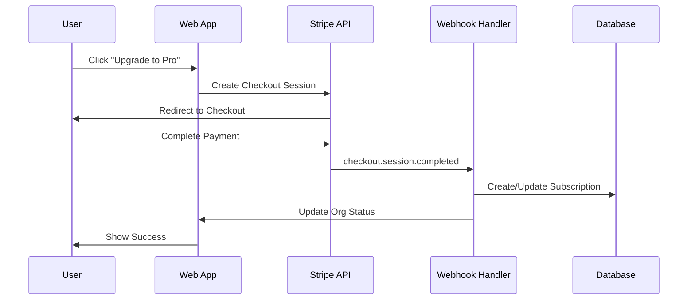

# Billing

**Complete guide to billing and subscriptions in the LiNKdev Starter Kit**

---

## Table of Contents

1. [Overview](#overview)
2. [Architecture](#architecture)
3. [Plans & Pricing](#plans--pricing)
4. [Getting Started](#getting-started)
5. [Stripe Integration](#stripe-integration)
6. [Entitlements System](#entitlements-system)
7. [Usage Tracking](#usage-tracking)
8. [Testing](#testing)
9. [Troubleshooting](#troubleshooting)

---

## Overview

The LiNKdev Starter Kit uses **organization-scoped billing** with Stripe integration. All subscriptions are managed at the organization level, enabling:

- **Multi-user organizations** with seat-based pricing
- **Feature gating** based on subscription plans
- **Usage limits** enforced per organization
- **Stripe Checkout** for seamless payment flows
- **Customer Portal** for subscription management

### Key Concepts

- **Organizations** - Every user has a personal org (auto-created)
- **Subscriptions** - Org-level subscriptions (not user-level)
- **Entitlements** - Feature access based on plan
- **Usage Limits** - Enforced per organization
- **Seats** - Number of members allowed in an org

---

## Architecture

### Database Schema

**Organizations:**

```sql
organizations (
  id uuid PRIMARY KEY,
  name text,
  owner_id uuid REFERENCES auth.users,
  is_personal boolean DEFAULT false,
  org_type text CHECK (org_type IN ('personal', 'business', 'family', 'education')),
  created_at timestamptz
)
```

**Billing Customers:**

```sql
billing_customers (
  org_id uuid PRIMARY KEY REFERENCES organizations(id),
  stripe_customer_id text UNIQUE,
  billing_email text,
  created_at timestamptz
)
```

**Organization Subscriptions:**

```sql
org_subscriptions (
  org_id uuid PRIMARY KEY REFERENCES organizations(id),
  plan_name text CHECK (plan_name IN ('free', 'pro', 'business', 'enterprise')),
  status text CHECK (status IN ('active', 'trialing', 'canceled', 'past_due')),
  billing_interval text CHECK (billing_interval IN ('monthly', 'annual')),
  seats integer DEFAULT 1,
  stripe_sub_id text UNIQUE,
  stripe_price_id text,
  current_period_start timestamptz,
  current_period_end timestamptz,
  created_at timestamptz
)
```

**Plan Features:**

```sql
plan_features (
  id uuid PRIMARY KEY,
  plan_name text CHECK (plan_name IN ('free', 'pro', 'business', 'enterprise')),
  feature_key text NOT NULL,
  feature_value jsonb NOT NULL,
  UNIQUE(plan_name, feature_key)
)
```

### Billing Flow



---

## Plans & Pricing

### Free Plan

- **Price:** $0/month
- **Seats:** 1
- **Limits:**
  - 100 records
  - 1,000 API calls/month
  - 3 automations
  - 1 GB storage
  - 50 MAU
  - 5 schedules
  - 5,000 AI tokens/month
- **Features:** Basic functionality only

### Pro Plan

- **Price:** $29/month or $290/year (save 17%)
- **Seats:** 1-5 (additional seats: $10/seat/month)
- **Limits:**
  - 10,000 records
  - 100,000 API calls/month
  - 25 automations
  - 50 GB storage
  - 1,000 MAU
  - 50 schedules
  - 100,000 AI tokens/month
- **Features:** Advanced analytics, API access

### Business Plan

- **Price:** $99/month or $990/year (save 17%)
- **Seats:** 1-50 (additional seats: $8/seat/month)
- **Limits:**
  - 100,000 records
  - 1,000,000 API calls/month
  - 100 automations
  - 500 GB storage
  - 10,000 MAU
  - 200 schedules
  - 1,000,000 AI tokens/month
- **Features:** All Pro features + SSO, custom branding, priority support

### Enterprise Plan

- **Price:** Custom pricing
- **Seats:** Unlimited
- **Limits:** Unlimited (all -1 in database)
- **Features:** All Business features + dedicated support, custom contracts, SLA

---

## Getting Started

### Environment Setup

**Required Environment Variables:**

```bash
# Stripe Configuration
STRIPE_SECRET_KEY=your_stripe_secret_key
NEXT_PUBLIC_STRIPE_PUBLISHABLE_KEY=your_stripe_publishable_key
STRIPE_WEBHOOK_SECRET=your_stripe_webhook_secret

# Stripe Price IDs (optional - will use mock data if not provided)
STRIPE_PRO_MONTHLY_PRICE_ID=price_your_pro_monthly_price_id
STRIPE_PRO_YEARLY_PRICE_ID=price_your_pro_yearly_price_id
STRIPE_ENTERPRISE_MONTHLY_PRICE_ID=price_your_enterprise_monthly_price_id
STRIPE_ENTERPRISE_YEARLY_PRICE_ID=price_your_enterprise_yearly_price_id

# Billing Configuration
BILLING_OFFLINE=1  # Enable offline mode for template development
TEMPLATE_OFFLINE=1  # Enable template offline mode
```

### Quick Start

**1. Get Available Plans:**

```typescript
import { api } from '@/lib/trpc/client';

function PricingPage() {
  const { data: plansData } = api.billing.getPlans.useQuery();
  
  return (
    <div>
      {plansData?.plans.map(plan => (
        <div key={plan.id}>
          <h3>{plan.name}</h3>
          <p>{plan.description}</p>
          <p>${plan.price_monthly}/month</p>
        </div>
      ))}
    </div>
  );
}
```

**2. Get Organization Subscription:**

```typescript
function BillingSettings({ orgId }: { orgId: string }) {
  const { data: subscriptionData } = api.billing.getSubscription.useQuery({ 
    orgId 
  });
  
  if (!subscriptionData?.subscription) {
    return <div>No active subscription</div>;
  }
  
  return (
    <div>
      <h3>Current Plan: {subscriptionData.subscription.plan}</h3>
      <p>Status: {subscriptionData.subscription.status}</p>
      <p>Period: {subscriptionData.subscription.current_period_start} - {subscriptionData.subscription.current_period_end}</p>
    </div>
  );
}
```

**3. Create Checkout Session:**

```typescript
function UpgradeButton({ orgId, plan }: { orgId: string; plan: string }) {
  const createCheckout = api.billing.createCheckout.useMutation();
  
  const handleUpgrade = async () => {
    const result = await createCheckout.mutateAsync({
      orgId,
      plan,
      successUrl: `${window.location.origin}/settings/billing?success=true`,
      cancelUrl: `${window.location.origin}/pricing?canceled=true`,
    });
    
    if (result.url) {
      window.location.href = result.url;
    }
  };
  
  return <button onClick={handleUpgrade}>Upgrade to {plan}</button>;
}
```

**4. Open Customer Portal:**

```typescript
function ManageSubscriptionButton({ orgId }: { orgId: string }) {
  const openPortal = api.billing.openPortal.useMutation();
  
  const handleManage = async () => {
    const result = await openPortal.mutateAsync({
      orgId,
      returnUrl: `${window.location.origin}/settings/billing`,
    });
    
    if (result.url) {
      window.location.href = result.url;
    }
  };
  
  return <button onClick={handleManage}>Manage Subscription</button>;
}
```

---

## Stripe Integration

### Webhook Setup

**1. Configure Stripe Webhook:**

1. Go to your [Stripe Dashboard](https://dashboard.stripe.com/webhooks)
2. Click "Add endpoint"
3. Set the endpoint URL to: `https://yourdomain.com/api/webhooks/stripe`
4. Select these events:
   - `checkout.session.completed`
   - `customer.subscription.created`
   - `customer.subscription.updated`
   - `customer.subscription.deleted`
   - `invoice.paid`
   - `invoice.payment_failed`
5. Copy the webhook signing secret to your environment variables

**2. Webhook Handler:**

```typescript
// app/api/webhooks/stripe/route.ts
import { headers } from 'next/headers';
import Stripe from 'stripe';
import { stripe } from '@/lib/stripe/server';
import { createClient } from '@/lib/supabase/server';

export async function POST(request: Request) {
  const body = await request.text();
  const signature = headers().get('stripe-signature');

  if (!signature) {
    return new Response('Missing signature', { status: 400 });
  }

  let event: Stripe.Event;

  try {
    event = stripe.webhooks.constructEvent(
      body,
      signature,
      process.env.STRIPE_WEBHOOK_SECRET!
    );
  } catch (err) {
    return new Response(`Webhook Error: ${err.message}`, { status: 400 });
  }

  const supabase = createClient();

  switch (event.type) {
    case 'checkout.session.completed': {
      const session = event.data.object as Stripe.Checkout.Session;
      const orgId = session.metadata?.org_id;

      if (orgId) {
        // Create/update subscription
        await supabase
          .from('org_subscriptions')
          .upsert({
            org_id: orgId,
            plan_name: session.metadata?.plan_name || 'pro',
            status: 'active',
            stripe_sub_id: session.subscription as string,
            current_period_start: new Date().toISOString(),
            current_period_end: new Date(Date.now() + 30 * 24 * 60 * 60 * 1000).toISOString(),
          });
      }
      break;
    }

    case 'customer.subscription.updated': {
      const subscription = event.data.object as Stripe.Subscription;
      // Update subscription details
      break;
    }

    case 'customer.subscription.deleted': {
      const subscription = event.data.object as Stripe.Subscription;
      // Mark subscription as canceled
      break;
    }

    case 'invoice.paid': {
      const invoice = event.data.object as Stripe.Invoice;
      // Extend subscription period
      break;
    }

    case 'invoice.payment_failed': {
      const invoice = event.data.object as Stripe.Invoice;
      // Update status to past_due
      break;
    }
  }

  return new Response(JSON.stringify({ received: true }), { status: 200 });
}
```

### Offline Mode

When `TEMPLATE_OFFLINE=1` or Stripe environment variables are missing, the billing module runs in offline mode:

- **Mock checkout sessions** with deterministic URLs
- **Simulated webhook events** via `simulateEvent` mutation
- **In-memory subscription storage** for development
- **Fake customer portal** URLs

**Simulate Events (Offline Only):**

```typescript
function SimulateEventButton({ orgId }: { orgId: string }) {
  const simulateEvent = api.billing.simulateEvent.useMutation();
  
  const handleSimulate = async (eventType: string) => {
    await simulateEvent.mutateAsync({
      type: eventType as any,
      orgId,
    });
  };
  
  return (
    <div>
      <button onClick={() => handleSimulate('checkout.session.completed')}>
        Simulate Checkout Success
      </button>
      <button onClick={() => handleSimulate('customer.subscription.created')}>
        Simulate Subscription Created
      </button>
    </div>
  );
}
```

---

## Entitlements System

### Server-Side Entitlement Checks

```typescript
import { hasEntitlement, hasExceededLimit } from '@/utils/billing/entitlements';

// Check if org can use automation
const canUseAutomation = await hasEntitlement(orgId, 'can_use_automation', supabase);

// Check if org has exceeded record limit
const hasExceededRecords = await hasExceededLimit(
  orgId, 
  'max_records', 
  currentRecordCount, 
  supabase
);
```

### Client-Side Entitlement Hook

```typescript
import { useEntitlement } from '@/hooks/use-entitlement';

function FeatureGate({ children, feature }: { children: React.ReactNode; feature: string }) {
  const { hasEntitlement, isLoading } = useEntitlement(feature);
  
  if (isLoading) return <div>Loading...</div>;
  if (!hasEntitlement) return <div>This feature requires a paid plan</div>;
  
  return <>{children}</>;
}

// Usage
<FeatureGate feature="can_use_automation">
  <AutomationSettings />
</FeatureGate>
```

### Guards

**Server-side Guards:**

```typescript
import { assertEntitlement } from '@/utils/billing/guards';

// In your tRPC procedure
await assertEntitlement(orgId, 'can_use_automation', supabase);
```

**Client-side Guards:**

```typescript
import { Paywall } from '@/components/billing/Paywall';

<Paywall feature="can_use_automation" orgId={orgId}>
  <AutomationComponent />
</Paywall>
```

**Route Guards:**

```typescript
import { useRequirePlan } from '@/middleware/requirePlan';

function ProtectedPage() {
  const { allowed, component } = useRequirePlan({
    orgId: 'your-org-id',
    feature: 'can_use_automation',
    redirectTo: '/pricing'
  });

  if (!allowed) return component;
  
  return <YourProtectedContent />;
}
```

---

## Usage Tracking

### Logging Usage Events

```typescript
// Log a record creation
async function logRecordCreated(userId: string, orgId: string) {
  await supabase
    .from('usage_events')
    .insert({
      user_id: userId,
      org_id: orgId,
      event_type: 'record_created',
      quantity: 1,
      event_data: {
        record_type: 'contact',
        timestamp: new Date().toISOString()
      }
    });
}
```

### Checking Usage Limits

```typescript
async function checkUsageLimit(
  orgId: string,
  metricType: string,
  limit: number
): Promise<{ allowed: boolean; current: number; limit: number }> {
  const startOfMonth = new Date();
  startOfMonth.setDate(1);
  startOfMonth.setHours(0, 0, 0, 0);
  
  // Sum usage for current month
  const { data: events } = await supabase
    .from('usage_events')
    .select('quantity')
    .eq('org_id', orgId)
    .eq('event_type', metricType)
    .gte('created_at', startOfMonth.toISOString());
  
  const current = events.reduce((sum, e) => sum + e.quantity, 0);
  
  return {
    allowed: current < limit,
    current,
    limit
  };
}

// Usage:
const { allowed, current, limit } = await checkUsageLimit(
  orgId,
  'api_call',
  100000
);

if (!allowed) {
  throw new Error(`API call limit reached (${current}/${limit}). Upgrade your plan.`);
}
```

### Usage Dashboard

```typescript
function UsageOverview({ orgId }: { orgId: string }) {
  const { data: usage } = useQuery({
    queryKey: ['usage', orgId],
    queryFn: () => getCurrentMonthUsage(orgId)
  });
  
  const { data: limits } = useQuery({
    queryKey: ['limits', orgId],
    queryFn: () => getOrgLimits(orgId)
  });
  
  return (
    <div className="grid grid-cols-1 md:grid-cols-2 lg:grid-cols-3 gap-4">
      {metrics.map(metric => {
        const current = usage?.[metric.key] || 0;
        const limit = limits?.[`max_${metric.key}`] || 0;
        const percentage = limit === -1 ? 0 : (current / limit) * 100;
        
        return (
          <Card key={metric.key}>
            <CardHeader>
              <CardTitle>{metric.label}</CardTitle>
            </CardHeader>
            <CardContent>
              <div className="text-2xl font-bold">
                {current.toLocaleString()}
              </div>
              <p className="text-xs text-muted-foreground">
                {limit === -1 ? 'Unlimited' : `of ${limit.toLocaleString()} limit`}
              </p>
              {limit !== -1 && (
                <Progress value={percentage} className="mt-2" />
              )}
            </CardContent>
          </Card>
        );
      })}
    </div>
  );
}
```

---

## Testing

### Running Tests

**Run All Billing Tests:**

```bash
pnpm --filter ./apps/web test billing
```

**Run Unit Tests Only:**

```bash
pnpm --filter ./apps/web test src/__tests__/actions/billing
```

**Run Integration Tests Only:**

```bash
pnpm --filter ./apps/web test src/__tests__/api/webhooks/stripe
```

**Run E2E Tests:**

```bash
pnpm --filter ./apps/web e2e billing-checkout.spec.ts
```

**Run with Coverage:**

```bash
pnpm --filter ./apps/web test:coverage
```

### Test Coverage

**Current Coverage Targets:**

- **Lines**: 80%
- **Functions**: 80%
- **Branches**: 75%
- **Statements**: 80%

**Viewing Coverage Reports:**

```bash
open apps/web/coverage/index.html
```

### Mocking Strategy

**Stripe API Mocks:**

```typescript
import { mockStripeCustomer, createMockStripeEvent } from '../helpers/stripe-mocks';

const event = createMockStripeEvent('customer.subscription.created', mockStripeSubscription);
```

**Test Pattern:**

```typescript
describe('createOrgStripeCustomer', () => {
  beforeEach(() => {
    vi.clearAllMocks();
  });

  it('should create a new Stripe customer', async () => {
    // Setup mocks
    vi.mocked(mockSupabaseClient.from).mockImplementation(...);
    
    // Execute action
    const result = await createOrgStripeCustomer('test-org-id');
    
    // Verify results
    expect(result.success).toBe(true);
    expect(stripeServer.createStripeCustomer).toHaveBeenCalled();
  });
});
```

### Manual Testing

**1. Setup Stripe CLI:**

```bash
pnpm --filter ./apps/web stripe:login
```

**2. Listen for webhooks:**

```bash
pnpm --filter ./apps/web stripe:listen
```

**3. Test checkout flow:**

- Navigate to `/billing`
- Click "Upgrade" on a plan
- Use Stripe test card: `4242 4242 4242 4242`
- Verify webhook events in terminal

**4. Test billing portal:**

- Click "Manage Billing"
- Verify redirect to Stripe portal
- Test subscription management

---

## Troubleshooting

### Issue: Webhook not updating subscription

**Check:**
1. Webhook signature verification passing?
2. Metadata includes correct `org_id`?
3. Service role key being used?
4. Database RLS policies not blocking service role?

**Debug:**

```sql
-- Check if subscription exists
SELECT * FROM org_subscriptions WHERE org_id = 'org-uuid';

-- Check Stripe subscription ID
SELECT * FROM org_subscriptions WHERE stripe_sub_id = 'sub_xxx';
```

### Issue: User can't access paid features

**Check:**
1. Subscription status is 'active'?
2. User is member of the org?
3. Feature gate checking correct org_id?
4. Plan features seeded correctly?

**Debug:**

```sql
-- Check user's org membership
SELECT * FROM organization_members WHERE user_id = 'user-uuid';

-- Check org subscription
SELECT * FROM org_subscriptions WHERE org_id = 'org-uuid';

-- Check feature limits
SELECT * FROM plan_features WHERE plan_name = 'pro';
```

### Issue: Seat limit not enforced

**Check:**
1. Frontend checking seat count before invite?
2. Backend validating seat availability?
3. Subscription seats value correct?

**Debug:**

```sql
-- Count current members
SELECT count(*) FROM organization_members WHERE org_id = 'org-uuid';

-- Check subscription seats
SELECT seats FROM org_subscriptions WHERE org_id = 'org-uuid';
```

### Issue: Tests failing locally

**Solutions:**

1. **Clear node_modules and reinstall:**
   ```bash
   rm -rf node_modules
   pnpm install
   ```

2. **Check mock setup:**
   - Ensure `vi.clearAllMocks()` in `beforeEach()`
   - Verify mock implementations match actual APIs

3. **Check test isolation:**
   - Each test should be independent
   - No shared state between tests

### Issue: Coverage not meeting threshold

1. Run coverage report: `pnpm test:coverage`
2. Open HTML report: `open coverage/index.html`
3. Identify uncovered lines
4. Add tests for uncovered branches

---

## Related Documentation

- **Architecture:** [../02_ARCHITECTURE/BILLING_ARCHITECTURE.md](../02_ARCHITECTURE/BILLING_ARCHITECTURE.md)
- **Feature Flags:** [FEATURE_FLAGS.md](./FEATURE_FLAGS.md)
- **Usage Tracking:** [USAGE_TRACKING.md](./USAGE_TRACKING.md)
- **Permissions:** [PERMISSIONS.md](./PERMISSIONS.md)
- **Development Guide:** [../03_DEVELOPMENT/DEVELOPMENT_GUIDE.md](../03_DEVELOPMENT/DEVELOPMENT_GUIDE.md)

---

**Last Updated:** 2025-01-27
