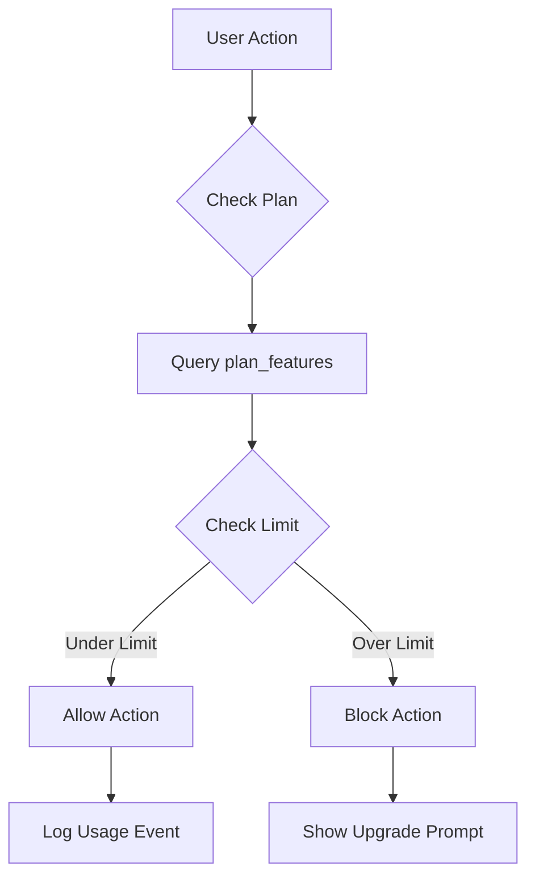

# Feature Flags

**Complete guide to feature gating and plan-based access control**

---

## Table of Contents

1. [Overview](#overview)
2. [Architecture](#architecture)
3. [Database Schema](#database-schema)
4. [Plan Features](#plan-features)
5. [Checking Feature Access](#checking-feature-access)
6. [Implementing Feature Gates](#implementing-feature-gates)
7. [Frontend Feature Gates](#frontend-feature-gates)
8. [Upgrade Prompts](#upgrade-prompts)
9. [Testing](#testing)
10. [Troubleshooting](#troubleshooting)

---

## Overview

The LTM Starter Kit includes a comprehensive feature gating system that controls access to features based on subscription plans. This enables:

- **Plan differentiation** - Free vs Pro vs Business vs Enterprise features
- **Upsell opportunities** - Show upgrade prompts when users hit limits
- **Flexible pricing** - Easy to adjust limits without code changes
- **A/B testing** - Test different feature sets for different plans

### Key Concepts

- **Feature Keys** - Unique identifiers for features (e.g., `max_records`, `can_use_automation`)
- **Feature Values** - JSONB values defining limits or boolean flags
- **Plan Features** - Database-driven feature definitions per plan
- **Feature Gates** - Code checks that enforce feature access

---

## Architecture

### Database-Driven Feature Gates

All feature limits and flags are stored in the `plan_features` table, allowing dynamic updates without code deployments.

```
User Action → Check Plan → Query plan_features → Allow/Block → Log Usage
```

### Flow Diagram



---

## Database Schema

### Plan Features Table

```sql
plan_features (
  id uuid PRIMARY KEY,
  plan_name text CHECK (plan_name IN ('free', 'pro', 'business', 'enterprise')),
  feature_key text NOT NULL,
  feature_value jsonb NOT NULL,
  created_at timestamptz,
  updated_at timestamptz,
  UNIQUE(plan_name, feature_key)
)
```

**Feature Keys:**

- `max_records` - Maximum number of records
- `max_api_calls_per_month` - API call limit
- `max_automations` - Automation workflows limit
- `max_storage_gb` - Storage limit in GB
- `max_mau` - Monthly active users limit
- `max_schedules` - Scheduled tasks limit
- `max_ai_tokens_per_month` - AI API tokens limit
- `max_seats` - Organization seat limit
- `features` - Boolean feature flags (advanced_analytics, sso, etc.)

---

## Plan Features

### Free Plan

```json
{
  "max_records": { "limit": 100 },
  "max_api_calls_per_month": { "limit": 1000 },
  "max_automations": { "limit": 3 },
  "max_storage_gb": { "limit": 1 },
  "max_mau": { "limit": 50 },
  "max_schedules": { "limit": 5 },
  "max_ai_tokens_per_month": { "limit": 5000 },
  "max_seats": { "limit": 1 },
  "features": {
    "advanced_analytics": false,
    "priority_support": false,
    "sso": false,
    "custom_branding": false,
    "api_access": false
  }
}
```

### Pro Plan

```json
{
  "max_records": { "limit": 10000 },
  "max_api_calls_per_month": { "limit": 100000 },
  "max_automations": { "limit": 25 },
  "max_storage_gb": { "limit": 50 },
  "max_mau": { "limit": 1000 },
  "max_schedules": { "limit": 50 },
  "max_ai_tokens_per_month": { "limit": 100000 },
  "max_seats": { "limit": 5 },
  "features": {
    "advanced_analytics": true,
    "priority_support": false,
    "sso": false,
    "custom_branding": false,
    "api_access": true
  }
}
```

### Business Plan

```json
{
  "max_records": { "limit": 100000 },
  "max_api_calls_per_month": { "limit": 1000000 },
  "max_automations": { "limit": 100 },
  "max_storage_gb": { "limit": 500 },
  "max_mau": { "limit": 10000 },
  "max_schedules": { "limit": 200 },
  "max_ai_tokens_per_month": { "limit": 1000000 },
  "max_seats": { "limit": 50 },
  "features": {
    "advanced_analytics": true,
    "priority_support": true,
    "sso": true,
    "custom_branding": true,
    "api_access": true
  }
}
```

### Enterprise Plan

```json
{
  "max_records": { "limit": -1 },
  "max_api_calls_per_month": { "limit": -1 },
  "max_automations": { "limit": -1 },
  "max_storage_gb": { "limit": -1 },
  "max_mau": { "limit": -1 },
  "max_schedules": { "limit": -1 },
  "max_ai_tokens_per_month": { "limit": -1 },
  "max_seats": { "limit": -1 },
  "features": {
    "advanced_analytics": true,
    "priority_support": true,
    "sso": true,
    "custom_branding": true,
    "api_access": true,
    "dedicated_support": true,
    "custom_contracts": true
  }
}
```

**Note:** `-1` means unlimited

---

## Checking Feature Access

### Database Function

```sql
-- Built-in function (already in migration)
SELECT check_feature_access(
  p_user_id := 'user-uuid',
  p_feature_key := 'max_records',
  p_org_id := 'org-uuid'
);

-- Returns: {"limit": 10000}
```

### TypeScript Helper Functions

```typescript
// lib/features.ts

/**
 * Get feature limits for an organization
 */
export async function getFeatureLimits(
  orgId: string,
  featureKey: string
): Promise<{ limit: number } | null> {
  const { data, error } = await supabase.rpc('check_feature_access', {
    p_user_id: null,
    p_feature_key: featureKey,
    p_org_id: orgId
  });
  
  if (error) {
    console.error('Error checking feature access:', error);
    return null;
  }
  
  return data;
}

/**
 * Check if a feature is enabled for an organization
 */
export async function isFeatureEnabled(
  orgId: string,
  featureName: string
): Promise<boolean> {
  const limits = await getFeatureLimits(orgId, 'features');
  
  if (!limits) return false;
  
  return limits[featureName] === true;
}

/**
 * Check if organization has reached a usage limit
 */
export async function hasReachedLimit(
  orgId: string,
  metricType: string,
  currentUsage: number
): Promise<{ reached: boolean; limit: number; current: number }> {
  const limits = await getFeatureLimits(orgId, `max_${metricType}`);
  
  if (!limits) {
    return { reached: true, limit: 0, current: currentUsage };
  }
  
  const limit = limits.limit;
  
  // -1 means unlimited
  if (limit === -1) {
    return { reached: false, limit: -1, current: currentUsage };
  }
  
  return {
    reached: currentUsage >= limit,
    limit,
    current: currentUsage
  };
}
```

---

## Implementing Feature Gates

### 1. Quantity Limits (Records, API Calls, etc.)

```typescript
// app/api/records/route.ts
export async function POST(req: NextRequest) {
  const { user, orgId } = await getSession(req);
  const body = await req.json();
  
  // Count current records
  const { count: currentRecords } = await supabase
    .from('records')
    .select('*', { count: 'exact', head: true })
    .eq('org_id', orgId);
  
  // Check limit
  const { reached, limit, current } = await hasReachedLimit(
    orgId,
    'records',
    currentRecords
  );
  
  if (reached) {
    return Response.json({
      error: 'Record limit reached',
      message: `You've reached your limit of ${limit} records. Upgrade to create more.`,
      current,
      limit,
      upgrade_url: '/dashboard/settings/billing'
    }, { status: 403 });
  }
  
  // Create record
  const { data: record, error } = await supabase
    .from('records')
    .insert({
      ...body,
      org_id: orgId,
      created_by: user.id
    })
    .select()
    .single();
  
  if (error) {
    return Response.json({ error: error.message }, { status: 500 });
  }
  
  // Log usage
  await logUsageEvent(user.id, orgId, 'record_created', 1);
  
  return Response.json(record);
}
```

### 2. Boolean Feature Flags (SSO, Custom Branding, etc.)

```typescript
// app/api/sso/configure/route.ts
export async function POST(req: NextRequest) {
  const { user, orgId } = await getSession(req);
  
  // Check if SSO is enabled for this org's plan
  const ssoEnabled = await isFeatureEnabled(orgId, 'sso');
  
  if (!ssoEnabled) {
    return Response.json({
      error: 'Feature not available',
      message: 'SSO is only available on Business and Enterprise plans.',
      upgrade_url: '/dashboard/settings/billing'
    }, { status: 403 });
  }
  
  // Configure SSO
  const body = await req.json();
  const ssoConfig = await configureSSOProvider(orgId, body);
  
  return Response.json(ssoConfig);
}
```

### 3. Middleware for Global Feature Gating

```typescript
// middleware/featureGate.ts
export function featureGate(featureName: string) {
  return async (req: NextRequest) => {
    const { orgId } = await getSession(req);
    
    const enabled = await isFeatureEnabled(orgId, featureName);
    
    if (!enabled) {
      throw new FeatureNotAvailableError(
        `This feature is not available on your current plan.`,
        featureName
      );
    }
  };
}

// Usage:
export const POST = featureGate('advanced_analytics')(async (req) => {
  // Handle advanced analytics request
});
```

---

## Frontend Feature Gates

### 1. React Hook for Feature Access

```typescript
// hooks/useFeatureAccess.ts
export function useFeatureAccess(featureKey: string) {
  const { currentOrg } = useOrganization();
  
  const { data: limits, isLoading } = useQuery({
    queryKey: ['feature-limits', currentOrg?.id, featureKey],
    queryFn: () => getFeatureLimits(currentOrg.id, featureKey),
    enabled: !!currentOrg?.id
  });
  
  return {
    limits,
    isLoading,
    isUnlimited: limits?.limit === -1,
    hasAccess: limits !== null
  };
}

// Usage in component:
export function RecordsList() {
  const { limits, isUnlimited } = useFeatureAccess('max_records');
  const { data: records } = useRecords();
  
  const canCreateMore = isUnlimited || (records.length < limits?.limit);
  
  return (
    <div>
      <div className="flex justify-between items-center">
        <h2>Records ({records.length}{!isUnlimited && ` / ${limits?.limit}`})</h2>
        <Button disabled={!canCreateMore}>
          Create Record
        </Button>
      </div>
      
      {!canCreateMore && (
        <Alert>
          <AlertTitle>Limit Reached</AlertTitle>
          <AlertDescription>
            You've reached your limit of {limits?.limit} records.
            <Link href="/dashboard/settings/billing">Upgrade your plan</Link> to create more.
          </AlertDescription>
        </Alert>
      )}
    </div>
  );
}
```

### 2. Feature Flag Hook

```typescript
// hooks/useFeatureFlag.ts
export function useFeatureFlag(featureName: string) {
  const { currentOrg } = useOrganization();
  
  const { data: features, isLoading } = useQuery({
    queryKey: ['features', currentOrg?.id],
    queryFn: async () => {
      const limits = await getFeatureLimits(currentOrg.id, 'features');
      return limits || {};
    },
    enabled: !!currentOrg?.id
  });
  
  return {
    isEnabled: features?.[featureName] === true,
    isLoading
  };
}

// Usage:
export function AnalyticsPage() {
  const { isEnabled, isLoading } = useFeatureFlag('advanced_analytics');
  
  if (isLoading) {
    return <Spinner />;
  }
  
  if (!isEnabled) {
    return (
      <UpgradePrompt
        feature="Advanced Analytics"
        description="Get detailed insights into your data with advanced analytics."
        requiredPlan="Pro"
      />
    );
  }
  
  return <AdvancedAnalyticsDashboard />;
}
```

### 3. Conditional Rendering Component

```typescript
// components/FeatureGate.tsx
interface FeatureGateProps {
  feature: string;
  fallback?: React.ReactNode;
  children: React.ReactNode;
}

export function FeatureGate({ feature, fallback, children }: FeatureGateProps) {
  const { isEnabled, isLoading } = useFeatureFlag(feature);
  
  if (isLoading) {
    return <Skeleton className="h-20 w-full" />;
  }
  
  if (!isEnabled) {
    return fallback || (
      <Card className="p-6 text-center">
        <Lock className="mx-auto h-12 w-12 text-muted-foreground mb-4" />
        <h3 className="text-lg font-semibold mb-2">Feature Locked</h3>
        <p className="text-muted-foreground mb-4">
          This feature is not available on your current plan.
        </p>
        <Button asChild>
          <Link href="/dashboard/settings/billing">Upgrade Plan</Link>
        </Button>
      </Card>
    );
  }
  
  return <>{children}</>;
}

// Usage:
<FeatureGate feature="custom_branding">
  <BrandingSettings />
</FeatureGate>
```

---

## Upgrade Prompts

### 1. Limit Reached Modal

```typescript
// components/LimitReachedModal.tsx
interface LimitReachedModalProps {
  isOpen: boolean;
  onClose: () => void;
  feature: string;
  current: number;
  limit: number;
  recommendedPlan: string;
}

export function LimitReachedModal({
  isOpen,
  onClose,
  feature,
  current,
  limit,
  recommendedPlan
}: LimitReachedModalProps) {
  return (
    <Dialog open={isOpen} onOpenChange={onClose}>
      <DialogContent>
        <DialogHeader>
          <DialogTitle>Limit Reached</DialogTitle>
          <DialogDescription>
            You've reached your {feature} limit of {limit}.
          </DialogDescription>
        </DialogHeader>
        
        <div className="py-4">
          <Progress value={(current / limit) * 100} className="mb-2" />
          <p className="text-sm text-muted-foreground">
            {current} / {limit} used
          </p>
        </div>
        
        <div className="space-y-4">
          <p>
            Upgrade to the <strong>{recommendedPlan}</strong> plan to get:
          </p>
          <ul className="list-disc list-inside space-y-1 text-sm">
            <li>Higher {feature} limits</li>
            <li>Advanced features</li>
            <li>Priority support</li>
          </ul>
        </div>
        
        <DialogFooter>
          <Button variant="outline" onClick={onClose}>
            Maybe Later
          </Button>
          <Button asChild>
            <Link href="/dashboard/settings/billing">
              Upgrade Now
            </Link>
          </Button>
        </DialogFooter>
      </DialogContent>
    </Dialog>
  );
}
```

### 2. Soft Limit Warning

```typescript
// Show warning at 80% of limit
export function UsageWarningBanner() {
  const { currentOrg } = useOrganization();
  const { data: usage } = useCurrentMonthUsage(currentOrg?.id);
  const { limits } = useFeatureAccess('max_records');
  
  if (!usage || !limits || limits.limit === -1) {
    return null;
  }
  
  const percentage = (usage.record_created / limits.limit) * 100;
  
  if (percentage < 80) {
    return null;
  }
  
  return (
    <Alert variant={percentage >= 95 ? 'destructive' : 'warning'}>
      <AlertTriangle className="h-4 w-4" />
      <AlertTitle>Approaching Limit</AlertTitle>
      <AlertDescription>
        You've used {usage.record_created} of {limits.limit} records ({percentage.toFixed(0)}%).
        {percentage >= 95 && ' Upgrade now to avoid service interruption.'}
        <Link href="/dashboard/settings/billing" className="underline ml-2">
          View Plans
        </Link>
      </AlertDescription>
    </Alert>
  );
}
```

---

## Testing

### Unit Tests

```typescript
describe('Feature Gating', () => {
  it('should allow action when under limit', async () => {
    await setupOrgWithPlan(testOrgId, 'pro'); // 10,000 records limit
    
    // Create 100 records
    for (let i = 0; i < 100; i++) {
      const result = await createRecord(testOrgId, { name: `Record ${i}` });
      expect(result).toBeDefined();
    }
  });
  
  it('should block action when limit reached', async () => {
    await setupOrgWithPlan(testOrgId, 'free'); // 100 records limit
    
    // Create 100 records
    for (let i = 0; i < 100; i++) {
      await createRecord(testOrgId, { name: `Record ${i}` });
    }
    
    // 101st should fail
    await expect(
      createRecord(testOrgId, { name: 'Record 101' })
    ).rejects.toThrow('Record limit reached');
  });
  
  it('should allow unlimited for enterprise', async () => {
    await setupOrgWithPlan(testOrgId, 'enterprise');
    
    // Create 100,000 records (should not fail)
    for (let i = 0; i < 100000; i++) {
      const result = await createRecord(testOrgId, { name: `Record ${i}` });
      expect(result).toBeDefined();
    }
  });
});
```

### Integration Tests

```typescript
describe('Feature Flag Integration', () => {
  it('should block SSO for free plan', async () => {
    await setupOrgWithPlan(testOrgId, 'free');
    
    const response = await fetch('/api/sso/configure', {
      method: 'POST',
      headers: { 'Authorization': `Bearer ${testToken}` },
      body: JSON.stringify({ provider: 'okta' })
    });
    
    expect(response.status).toBe(403);
    const data = await response.json();
    expect(data.error).toContain('not available');
  });
  
  it('should allow SSO for business plan', async () => {
    await setupOrgWithPlan(testOrgId, 'business');
    
    const response = await fetch('/api/sso/configure', {
      method: 'POST',
      headers: { 'Authorization': `Bearer ${testToken}` },
      body: JSON.stringify({ provider: 'okta' })
    });
    
    expect(response.status).toBe(200);
  });
});
```

---

## Troubleshooting

### Issue: Feature gate not working

**Check:**
1. Plan features seeded correctly?
2. Org has active subscription?
3. Feature key spelled correctly?

**Debug:**

```sql
-- Check org's subscription
SELECT * FROM org_subscriptions WHERE org_id = 'org-uuid';

-- Check plan features
SELECT * FROM plan_features WHERE plan_name = 'pro';

-- Test feature access function
SELECT check_feature_access(
  'user-uuid',
  'max_records',
  'org-uuid'
);
```

### Issue: Unlimited not working

**Check:**
1. Feature value is `-1` (not `null` or `0`)?
2. Comparison logic handles `-1` correctly?

**Debug:**

```sql
-- Check if limit is -1
SELECT feature_value 
FROM plan_features 
WHERE plan_name = 'enterprise' 
AND feature_key = 'max_records';
-- Should return: {"limit": -1}
```

### Best Practices

**1. Always Check Limits Before Action**

```typescript
// ❌ Bad: Create first, check later
const record = await createRecord(data);
await checkLimit(); // Too late!

// ✅ Good: Check first, then create
await checkLimit();
const record = await createRecord(data);
```

**2. Provide Clear Upgrade Paths**

```typescript
// ❌ Bad: Generic error
throw new Error('Limit reached');

// ✅ Good: Actionable error with upgrade link
throw new FeatureLimitError({
  message: 'Record limit reached',
  current: 100,
  limit: 100,
  upgradeUrl: '/dashboard/settings/billing',
  recommendedPlan: 'Pro'
});
```

**3. Cache Feature Limits**

```typescript
// ✅ Cache limits to avoid repeated queries
const limitsCache = new Map();

async function getFeatureLimitsWithCache(orgId: string, featureKey: string) {
  const cacheKey = `${orgId}:${featureKey}`;
  
  if (limitsCache.has(cacheKey)) {
    return limitsCache.get(cacheKey);
  }
  
  const limits = await getFeatureLimits(orgId, featureKey);
  limitsCache.set(cacheKey, limits);
  
  // Expire after 5 minutes
  setTimeout(() => limitsCache.delete(cacheKey), 5 * 60 * 1000);
  
  return limits;
}
```

---

## Related Documentation

- **Billing:** [BILLING.md](./BILLING.md)
- **Usage Tracking:** [USAGE_TRACKING.md](./USAGE_TRACKING.md)
- **Permissions:** [PERMISSIONS.md](./PERMISSIONS.md)
- **Development Guide:** [../03_DEVELOPMENT/DEVELOPMENT_GUIDE.md](../03_DEVELOPMENT/DEVELOPMENT_GUIDE.md)

---

**Last Updated:** 2025-01-27
