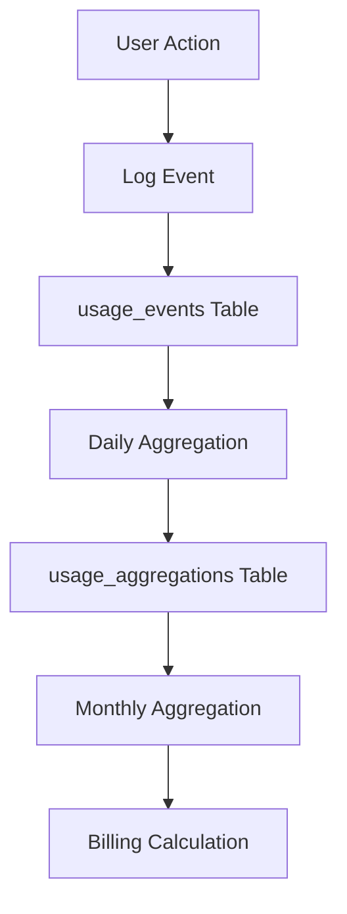

# Usage Tracking

**Complete guide to usage metering and tracking in the LTM Starter Kit**

---

## Table of Contents

1. [Overview](#overview)
2. [Architecture](#architecture)
3. [Database Schema](#database-schema)
4. [Logging Usage Events](#logging-usage-events)
5. [Querying Usage Data](#querying-usage-data)
6. [Aggregation Process](#aggregation-process)
7. [Usage Enforcement](#usage-enforcement)
8. [Usage Dashboard](#usage-dashboard)
9. [Testing](#testing)
10. [Troubleshooting](#troubleshooting)

---

## Overview

The LTM Starter Kit includes a comprehensive usage metering system to track customer consumption of various resources. This enables:

- **Plan enforcement** - Block actions when limits are reached
- **Billing calculations** - Charge for usage-based features
- **Analytics** - Understand customer behavior and resource usage
- **Forecasting** - Predict infrastructure needs

### Key Concepts

- **Usage Events** - Individual actions logged in real-time
- **Aggregations** - Daily/monthly rollups for efficient querying
- **Metrics** - Tracked resource types (records, API calls, storage, etc.)
- **Limits** - Plan-based usage limits enforced per organization

---

## Architecture

### Two-Tier System

1. **Raw Events** (`usage_events` table) - Individual actions logged in real-time
2. **Aggregations** (`usage_aggregations` table) - Daily/monthly rollups for efficient querying

```
User Action → Log Event → Aggregate Daily → Aggregate Monthly → Billing
```

### Flow Diagram



---

## Database Schema

### 1. Usage Events Table

```sql
usage_events (
  id uuid PRIMARY KEY,
  user_id uuid REFERENCES auth.users NOT NULL,
  org_id uuid REFERENCES organizations,
  event_type text CHECK (event_type IN (
    'record_created',
    'api_call',
    'automation_run',
    'storage_used',
    'schedule_executed',
    'ai_tokens_used',
    'user_active'
  )),
  event_data jsonb DEFAULT '{}',
  quantity numeric DEFAULT 1,
  created_at timestamptz DEFAULT now()
)
```

**Event Types:**
- `record_created` - New record added to database
- `api_call` - API endpoint called
- `automation_run` - Automation workflow executed
- `storage_used` - File uploaded (quantity = bytes)
- `schedule_executed` - Scheduled task ran
- `ai_tokens_used` - AI API tokens consumed
- `user_active` - User logged in/used app (for MAU tracking)

### 2. Usage Aggregations Table

```sql
usage_aggregations (
  id uuid PRIMARY KEY,
  user_id uuid REFERENCES auth.users,
  org_id uuid REFERENCES organizations,
  period_type text CHECK (period_type IN ('daily', 'monthly')),
  period_start timestamptz NOT NULL,
  period_end timestamptz NOT NULL,
  metric_type text NOT NULL,
  total_quantity numeric DEFAULT 0,
  metadata jsonb DEFAULT '{}',
  created_at timestamptz,
  updated_at timestamptz,
  UNIQUE(user_id, org_id, period_type, period_start, metric_type)
)
```

**Aggregation Periods:**
- `daily` - Rolled up every day at midnight UTC
- `monthly` - Rolled up on 1st of each month

---

## Logging Usage Events

### Basic Event Logging

```typescript
// Log a record creation
async function logRecordCreated(userId: string, orgId: string) {
  await supabase
    .from('usage_events')
    .insert({
      user_id: userId,
      org_id: orgId,
      event_type: 'record_created',
      quantity: 1,
      event_data: {
        record_type: 'contact',
        timestamp: new Date().toISOString()
      }
    });
}
```

### API Call Tracking

```typescript
// Middleware to log API calls
export async function apiUsageMiddleware(
  req: NextRequest,
  user: User,
  orgId: string
) {
  const startTime = Date.now();
  
  // Execute API handler
  const response = await next();
  
  const duration = Date.now() - startTime;
  
  // Log API call
  await supabase
    .from('usage_events')
    .insert({
      user_id: user.id,
      org_id: orgId,
      event_type: 'api_call',
      quantity: 1,
      event_data: {
        endpoint: req.url,
        method: req.method,
        duration_ms: duration,
        status_code: response.status
      }
    });
  
  return response;
}
```

### Storage Usage Tracking

```typescript
// Log file upload
async function logFileUpload(
  userId: string,
  orgId: string,
  file: File
) {
  await supabase
    .from('usage_events')
    .insert({
      user_id: userId,
      org_id: orgId,
      event_type: 'storage_used',
      quantity: file.size, // bytes
      event_data: {
        filename: file.name,
        mimetype: file.type,
        size_mb: (file.size / 1024 / 1024).toFixed(2)
      }
    });
}
```

### AI Token Tracking

```typescript
// Log AI API usage
async function logAITokens(
  userId: string,
  orgId: string,
  tokensUsed: number,
  model: string
) {
  await supabase
    .from('usage_events')
    .insert({
      user_id: userId,
      org_id: orgId,
      event_type: 'ai_tokens_used',
      quantity: tokensUsed,
      event_data: {
        model: model,
        timestamp: new Date().toISOString()
      }
    });
}
```

### Automation Run Tracking

```typescript
// Log automation execution
async function logAutomationRun(
  userId: string,
  orgId: string,
  automationId: string,
  success: boolean
) {
  await supabase
    .from('usage_events')
    .insert({
      user_id: userId,
      org_id: orgId,
      event_type: 'automation_run',
      quantity: 1,
      event_data: {
        automation_id: automationId,
        success: success,
        timestamp: new Date().toISOString()
      }
    });
}
```

### Monthly Active Users (MAU) Tracking

```typescript
// Log user activity (call on each session start)
async function logUserActive(userId: string, orgId: string) {
  // Check if already logged today
  const today = new Date();
  today.setHours(0, 0, 0, 0);
  
  const { data: existing } = await supabase
    .from('usage_events')
    .select('id')
    .eq('user_id', userId)
    .eq('org_id', orgId)
    .eq('event_type', 'user_active')
    .gte('created_at', today.toISOString())
    .single();
  
  if (!existing) {
    await supabase
      .from('usage_events')
      .insert({
        user_id: userId,
        org_id: orgId,
        event_type: 'user_active',
        quantity: 1,
        event_data: {
          session_start: new Date().toISOString()
        }
      });
  }
}
```

---

## Querying Usage Data

### Get Current Month Usage for Org

```typescript
async function getCurrentMonthUsage(orgId: string) {
  const startOfMonth = new Date();
  startOfMonth.setDate(1);
  startOfMonth.setHours(0, 0, 0, 0);
  
  const { data: events } = await supabase
    .from('usage_events')
    .select('event_type, quantity')
    .eq('org_id', orgId)
    .gte('created_at', startOfMonth.toISOString());
  
  // Group by event type
  const usage = events.reduce((acc, event) => {
    if (!acc[event.event_type]) {
      acc[event.event_type] = 0;
    }
    acc[event.event_type] += event.quantity;
    return acc;
  }, {} as Record<string, number>);
  
  return usage;
}

// Returns:
// {
//   record_created: 450,
//   api_call: 12500,
//   automation_run: 78,
//   storage_used: 5368709120, // bytes
//   ai_tokens_used: 45000,
//   user_active: 15
// }
```

### Get Usage from Aggregations (Faster)

```typescript
async function getMonthlyUsageFromAggregations(
  orgId: string,
  year: number,
  month: number
) {
  const periodStart = new Date(year, month - 1, 1);
  
  const { data: aggregations } = await supabase
    .from('usage_aggregations')
    .select('metric_type, total_quantity')
    .eq('org_id', orgId)
    .eq('period_type', 'monthly')
    .eq('period_start', periodStart.toISOString());
  
  return aggregations.reduce((acc, agg) => {
    acc[agg.metric_type] = agg.total_quantity;
    return acc;
  }, {} as Record<string, number>);
}
```

### Check if Limit Reached

```typescript
async function checkUsageLimit(
  orgId: string,
  metricType: string,
  limit: number
): Promise<{ allowed: boolean; current: number; limit: number }> {
  const startOfMonth = new Date();
  startOfMonth.setDate(1);
  startOfMonth.setHours(0, 0, 0, 0);
  
  // Sum usage for current month
  const { data: events } = await supabase
    .from('usage_events')
    .select('quantity')
    .eq('org_id', orgId)
    .eq('event_type', metricType)
    .gte('created_at', startOfMonth.toISOString());
  
  const current = events.reduce((sum, e) => sum + e.quantity, 0);
  
  return {
    allowed: current < limit,
    current,
    limit
  };
}

// Usage:
const { allowed, current, limit } = await checkUsageLimit(
  orgId,
  'api_call',
  100000
);

if (!allowed) {
  throw new Error(`API call limit reached (${current}/${limit}). Upgrade your plan.`);
}
```

---

## Aggregation Process

### Manual Aggregation (for testing)

```typescript
// Aggregate usage for a specific period
async function aggregateUsageForPeriod(
  periodType: 'daily' | 'monthly',
  periodStart: Date,
  periodEnd: Date
) {
  const { data, error } = await supabaseAdmin.rpc('aggregate_usage', {
    p_period_type: periodType,
    p_period_start: periodStart.toISOString(),
    p_period_end: periodEnd.toISOString()
  });
  
  if (error) {
    console.error('Aggregation failed:', error);
    throw error;
  }
  
  console.log('Aggregation complete');
}
```

### Automated Aggregation (Cron Job)

**Daily Aggregation** - Run at 00:05 UTC every day

```typescript
// pages/api/cron/aggregate-daily.ts
export default async function handler(req: NextRequest) {
  // Verify cron secret
  if (req.headers.get('authorization') !== `Bearer ${process.env.CRON_SECRET}`) {
    return new Response('Unauthorized', { status: 401 });
  }
  
  const yesterday = new Date();
  yesterday.setDate(yesterday.getDate() - 1);
  yesterday.setHours(0, 0, 0, 0);
  
  const today = new Date();
  today.setHours(0, 0, 0, 0);
  
  await aggregateUsageForPeriod('daily', yesterday, today);
  
  return new Response('Daily aggregation complete', { status: 200 });
}
```

**Monthly Aggregation** - Run at 00:10 UTC on 1st of each month

```typescript
// pages/api/cron/aggregate-monthly.ts
export default async function handler(req: NextRequest) {
  // Verify cron secret
  if (req.headers.get('authorization') !== `Bearer ${process.env.CRON_SECRET}`) {
    return new Response('Unauthorized', { status: 401 });
  }
  
  const lastMonth = new Date();
  lastMonth.setMonth(lastMonth.getMonth() - 1);
  lastMonth.setDate(1);
  lastMonth.setHours(0, 0, 0, 0);
  
  const thisMonth = new Date();
  thisMonth.setDate(1);
  thisMonth.setHours(0, 0, 0, 0);
  
  await aggregateUsageForPeriod('monthly', lastMonth, thisMonth);
  
  return new Response('Monthly aggregation complete', { status: 200 });
}
```

**Vercel Cron Configuration** (`vercel.json`):

```json
{
  "crons": [
    {
      "path": "/api/cron/aggregate-daily",
      "schedule": "5 0 * * *"
    },
    {
      "path": "/api/cron/aggregate-monthly",
      "schedule": "10 0 1 * *"
    }
  ]
}
```

---

## Usage Enforcement

### Before Action Middleware

```typescript
// middleware/checkUsageLimit.ts
export async function checkUsageLimitMiddleware(
  orgId: string,
  metricType: string,
  action: string
) {
  // Get org's plan limits
  const { data: subscription } = await supabase
    .from('org_subscriptions')
    .select('plan_name')
    .eq('org_id', orgId)
    .eq('status', 'active')
    .single();
  
  const planName = subscription?.plan_name || 'free';
  
  // Get feature limits
  const limits = await supabase.rpc('check_feature_access', {
    p_user_id: null,
    p_feature_key: `max_${metricType}`,
    p_org_id: orgId
  });
  
  const limit = limits.data?.limit || 0;
  
  // Check if unlimited (-1)
  if (limit === -1) {
    return { allowed: true };
  }
  
  // Check current usage
  const { allowed, current } = await checkUsageLimit(orgId, metricType, limit);
  
  if (!allowed) {
    throw new UsageLimitError(
      `${action} limit reached (${current}/${limit}). Upgrade to ${getNextPlan(planName)}.`,
      metricType,
      current,
      limit
    );
  }
  
  return { allowed: true, current, limit };
}

// Usage in API route:
export async function POST(req: NextRequest) {
  const { orgId } = await getSession(req);
  
  // Check limit before creating record
  await checkUsageLimitMiddleware(orgId, 'records', 'Record creation');
  
  // Create record
  const record = await createRecord(data);
  
  // Log usage
  await logRecordCreated(user.id, orgId);
  
  return Response.json(record);
}
```

---

## Usage Dashboard

### Usage Overview Component

```typescript
// components/usage/UsageOverview.tsx
export function UsageOverview({ orgId }: { orgId: string }) {
  const { data: usage } = useQuery({
    queryKey: ['usage', orgId],
    queryFn: () => getCurrentMonthUsage(orgId)
  });
  
  const { data: limits } = useQuery({
    queryKey: ['limits', orgId],
    queryFn: () => getOrgLimits(orgId)
  });
  
  const metrics = [
    { key: 'record_created', label: 'Records', icon: Database },
    { key: 'api_call', label: 'API Calls', icon: Zap },
    { key: 'automation_run', label: 'Automations', icon: Bot },
    { key: 'storage_used', label: 'Storage (GB)', icon: HardDrive, formatter: bytesToGB },
    { key: 'ai_tokens_used', label: 'AI Tokens', icon: Sparkles },
    { key: 'user_active', label: 'Active Users', icon: Users },
  ];
  
  return (
    <div className="grid grid-cols-1 md:grid-cols-2 lg:grid-cols-3 gap-4">
      {metrics.map(metric => {
        const current = usage?.[metric.key] || 0;
        const limit = limits?.[`max_${metric.key}`] || 0;
        const percentage = limit === -1 ? 0 : (current / limit) * 100;
        const isNearLimit = percentage > 80;
        
        return (
          <Card key={metric.key}>
            <CardHeader className="flex flex-row items-center justify-between space-y-0 pb-2">
              <CardTitle className="text-sm font-medium">
                {metric.label}
              </CardTitle>
              <metric.icon className="h-4 w-4 text-muted-foreground" />
            </CardHeader>
            <CardContent>
              <div className="text-2xl font-bold">
                {metric.formatter ? metric.formatter(current) : current.toLocaleString()}
              </div>
              <p className="text-xs text-muted-foreground">
                {limit === -1 ? 'Unlimited' : `of ${limit.toLocaleString()} limit`}
              </p>
              {limit !== -1 && (
                <>
                  <Progress value={percentage} className="mt-2" />
                  {isNearLimit && (
                    <p className="text-xs text-orange-600 mt-1">
                      Approaching limit. Consider upgrading.
                    </p>
                  )}
                </>
              )}
            </CardContent>
          </Card>
        );
      })}
    </div>
  );
}
```

---

## Testing

### Unit Test: Event Logging

```typescript
describe('Usage Event Logging', () => {
  it('should log record creation event', async () => {
    await logRecordCreated(testUserId, testOrgId);
    
    const { data: events } = await supabase
      .from('usage_events')
      .select('*')
      .eq('user_id', testUserId)
      .eq('event_type', 'record_created');
    
    expect(events).toHaveLength(1);
    expect(events[0].quantity).toBe(1);
  });
});
```

### Integration Test: Limit Enforcement

```typescript
describe('Usage Limit Enforcement', () => {
  it('should block action when limit reached', async () => {
    // Set up org with free plan (100 records limit)
    await setupOrgWithPlan(testOrgId, 'free');
    
    // Create 100 records
    for (let i = 0; i < 100; i++) {
      await createRecord(testOrgId, { name: `Record ${i}` });
    }
    
    // 101st record should fail
    await expect(
      createRecord(testOrgId, { name: 'Record 101' })
    ).rejects.toThrow('Record creation limit reached');
  });
});
```

---

## Troubleshooting

### Issue: Events not being logged

**Check:**
1. RLS policies allow insert?
2. User ID and Org ID are correct?
3. Event type is valid enum value?

**Debug:**

```sql
-- Check recent events
SELECT * FROM usage_events 
WHERE org_id = 'org-uuid' 
ORDER BY created_at DESC 
LIMIT 10;
```

### Issue: Aggregations not running

**Check:**
1. Cron job configured correctly?
2. Cron secret set in environment?
3. Function has correct permissions?

**Debug:**

```sql
-- Check last aggregation
SELECT * FROM usage_aggregations 
ORDER BY created_at DESC 
LIMIT 1;

-- Manually run aggregation
SELECT aggregate_usage('daily', '2025-11-12 00:00:00', '2025-11-13 00:00:00');
```

### Issue: Wrong usage counts

**Check:**
1. Timezone issues (all timestamps UTC)?
2. Duplicate events being logged?
3. Aggregation period overlaps?

**Debug:**

```sql
-- Compare raw events vs aggregation
SELECT 
  event_type,
  COUNT(*) as event_count,
  SUM(quantity) as total_quantity
FROM usage_events
WHERE org_id = 'org-uuid'
  AND created_at >= '2025-11-01'
  AND created_at < '2025-12-01'
GROUP BY event_type;

-- vs

SELECT 
  metric_type,
  total_quantity
FROM usage_aggregations
WHERE org_id = 'org-uuid'
  AND period_type = 'monthly'
  AND period_start = '2025-11-01';
```

### Performance Optimization

**1. Use Aggregations for Queries**

```typescript
// ❌ Slow: Query raw events every time
const usage = await supabase
  .from('usage_events')
  .select('quantity')
  .eq('org_id', orgId)
  .gte('created_at', startOfMonth);

// ✅ Fast: Query pre-aggregated data
const usage = await supabase
  .from('usage_aggregations')
  .select('total_quantity')
  .eq('org_id', orgId)
  .eq('period_type', 'monthly')
  .eq('period_start', startOfMonth);
```

**2. Batch Event Logging**

```typescript
// ❌ Slow: Log events one by one
for (const action of actions) {
  await logEvent(action);
}

// ✅ Fast: Batch insert
const events = actions.map(action => ({
  user_id: userId,
  org_id: orgId,
  event_type: action.type,
  quantity: action.quantity,
  event_data: action.data
}));

await supabase
  .from('usage_events')
  .insert(events);
```

---

## Related Documentation

- **Billing:** [BILLING.md](./BILLING.md)
- **Feature Flags:** [FEATURE_FLAGS.md](./FEATURE_FLAGS.md)
- **Development Guide:** [../03_DEVELOPMENT/DEVELOPMENT_GUIDE.md](../03_DEVELOPMENT/DEVELOPMENT_GUIDE.md)

---

**Last Updated:** 2025-01-27
