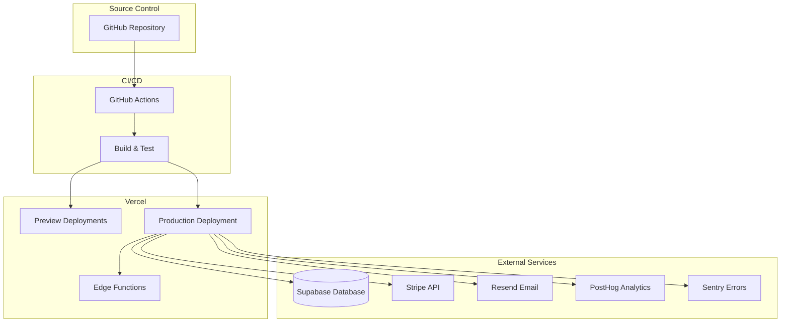

# Deployment Guide

**Complete guide to deploying the LiNKdev Starter Kit to production**

---

## Table of Contents

1. [Overview](#overview)
2. [Prerequisites](#prerequisites)
3. [Vercel Setup](#vercel-setup)
4. [Environment Variables](#environment-variables)
5. [Database Migrations](#database-migrations)
6. [CI/CD Pipeline](#cicd-pipeline)
7. [Post-Deployment Verification](#post-deployment-verification)
8. [Rollback Procedures](#rollback-procedures)
9. [Security Best Practices](#security-best-practices)
10. [Troubleshooting](#troubleshooting)

---

## Overview

The LiNKdev Starter Kit is designed to deploy seamlessly to **Vercel** with automatic builds, preview deployments, and production releases. This guide covers the complete deployment process from initial setup to production operations.

### Deployment Architecture



### Key Features

- **Automatic deployments** on push to main branch
- **Preview deployments** for pull requests
- **Edge functions** for low-latency API routes
- **Database migrations** via Supabase Dashboard or MCP
- **Environment-specific** configuration
- **Health checks** and monitoring

---

## Prerequisites

Before deploying, ensure you have:

### Required Accounts

- ✅ **Vercel Account** - [vercel.com](https://vercel.com)
- ✅ **Supabase Project** - [supabase.com](https://supabase.com)
- ✅ **Stripe Account** - [stripe.com](https://stripe.com)
- ✅ **GitHub Repository** - Your code repository

### Required Tools

- ✅ **Node.js 18+** - For local builds
- ✅ **pnpm** - Package manager
- ✅ **Git** - Version control
- ✅ **Vercel CLI** (optional) - `npm i -g vercel`

### Required Credentials

- ✅ Supabase project URL and API keys
- ✅ Stripe API keys (test and live)
- ✅ Resend API key (for emails)
- ✅ PostHog API key (for analytics)
- ✅ Sentry DSN (for error tracking)

**See:** [ENVIRONMENT_VARIABLES.md](./ENVIRONMENT_VARIABLES.md) for complete list.

---

## Vercel Setup

### Step 1: Connect Repository

1. Go to [vercel.com/dashboard](https://vercel.com/dashboard)
2. Click **"Add New Project"**
3. Import your GitHub repository
4. Select the repository and click **"Import"**

### Step 2: Configure Project Settings

**Root Directory:**
```
apps/web
```

**Build Command:**
```bash
pnpm build
```

**Output Directory:**
```
.next
```

**Install Command:**
```bash
pnpm install --frozen-lockfile
```

**Node.js Version:**
```
20.x
```

### Step 3: Configure Framework Preset

- **Framework Preset:** Next.js
- **Build Command:** Auto-detected (or use `pnpm build`)
- **Output Directory:** Auto-detected (or use `.next`)

### Step 4: Set Environment Variables

Go to **Settings → Environment Variables** and add all required variables:

**Required Variables:**
```bash
# Supabase
NEXT_PUBLIC_SUPABASE_URL=https://xxxxx.supabase.co
NEXT_PUBLIC_SUPABASE_ANON_KEY=eyJhbGciOiJIUzI1NiIsInR5cCI6IkpXVCJ9...
SUPABASE_SERVICE_ROLE_KEY=eyJhbGciOiJIUzI1NiIsInR5cCI6IkpXVCJ9...
SUPABASE_URL=https://xxxxx.supabase.co

# Stripe
STRIPE_SECRET_KEY=sk_live_...
NEXT_PUBLIC_STRIPE_PUBLISHABLE_KEY=pk_live_...
STRIPE_WEBHOOK_SECRET=whsec_...
STRIPE_PRICE_PRO_MONTHLY=price_...
STRIPE_PRICE_PRO_ANNUAL=price_...
STRIPE_PRICE_BUSINESS_MONTHLY=price_...
STRIPE_PRICE_BUSINESS_ANNUAL=price_...
STRIPE_PRICE_ENTERPRISE=price_...

# Application
NEXT_PUBLIC_SITE_URL=https://yourdomain.com

# Email
RESEND_API_KEY=re_...

# Analytics
NEXT_PUBLIC_POSTHOG_KEY=phc_...
NEXT_PUBLIC_POSTHOG_HOST=https://app.posthog.com

# Error Tracking
NEXT_PUBLIC_SENTRY_DSN=https://...@sentry.io/...
SENTRY_DSN=https://...@sentry.io/...
SENTRY_ENVIRONMENT=production
```

**Environment-Specific Variables:**

Set variables for specific environments:
- **Production** - Use live Stripe keys
- **Preview** - Use test Stripe keys
- **Development** - Use test keys

**See:** [ENVIRONMENT_VARIABLES.md](./ENVIRONMENT_VARIABLES.md) for complete reference.

### Step 5: Configure Domain

1. Go to **Settings → Domains**
2. Add your custom domain
3. Follow DNS configuration instructions
4. Wait for SSL certificate provisioning

### Step 6: Deploy

1. Click **"Deploy"** button
2. Wait for build to complete
3. Verify deployment at provided URL

---

## Environment Variables

### Production Environment Variables

All environment variables must be set in Vercel dashboard before deployment.

**Quick Setup:**

1. Go to **Project Settings → Environment Variables**
2. Add each variable with appropriate environment scope:
   - **Production** - Live keys
   - **Preview** - Test keys
   - **Development** - Test keys

**Validation:**

The app validates environment variables on startup. Missing required variables will cause deployment to fail.

**See:** [ENVIRONMENT_VARIABLES.md](./ENVIRONMENT_VARIABLES.md) for complete documentation.

### Environment Variable Security

**Best Practices:**

- ✅ Never commit secrets to git
- ✅ Use Vercel's environment variable encryption
- ✅ Rotate keys regularly
- ✅ Use different keys for production/preview
- ✅ Limit access to production environment variables

**Secrets Management:**

- Store sensitive keys in Vercel environment variables
- Use Vercel's built-in encryption
- Never expose service role keys to client
- Use separate Stripe accounts for test/production

---

## Database Migrations

### Pre-Deployment Migrations

Before deploying to production, ensure all migrations are applied:

**1. Review Migration Files:**

```bash
ls -la apps/web/supabase/migrations/
```

**2. Check Migration Status:**

Use Supabase Dashboard:
1. Go to **Database → Migrations**
2. Verify all migrations are applied
3. Check for any pending migrations

**3. Apply Migrations:**

**Option A: Supabase Dashboard (Recommended)**

1. Go to **SQL Editor**
2. Copy migration SQL
3. Paste and execute
4. Verify success

**Option B: MCP Tools (In Cursor)**

```
call SupabaseMCP.executeSQL
```

**Option C: Supabase CLI**

```bash
# Link to cloud project
cd apps/web
supabase link --project-ref <project-ref>

# Push migrations
supabase db push
```

### Post-Deployment Migrations

**For New Migrations:**

1. Create migration file in `apps/web/supabase/migrations/`
2. Test migration on development database
3. Apply to production via Supabase Dashboard
4. Verify migration success
5. Regenerate TypeScript types if needed

**Migration Best Practices:**

- ✅ Test migrations on development first
- ✅ Create rollback scripts for destructive changes
- ✅ Document breaking changes
- ✅ Apply migrations during low-traffic periods
- ✅ Monitor for errors after migration

**See:** [../03_DEVELOPMENT/DATABASE.md](../03_DEVELOPMENT/DATABASE.md) for detailed migration guide.

---

## CI/CD Pipeline

### GitHub Actions Workflow

The project includes a CI/CD pipeline that runs on every push and pull request.

**Workflow File:** `.github/workflows/ci.yml`

### Pipeline Stages

**1. Typecheck & Lint**

```yaml
- TypeScript type checking
- ESLint code linting
- Runs on: push, pull_request
```

**2. Unit Tests**

```yaml
- API unit tests
- Web unit tests
- Runs on: push, pull_request
```

**3. Integration Tests**

```yaml
- API integration tests
- Database integration tests
- Runs on: push, pull_request
```

**4. E2E Tests**

```yaml
- Playwright browser tests
- Critical user flows
- Runs on: push, pull_request
```

**5. Coverage**

```yaml
- Code coverage collection
- Upload to Codecov
- Runs on: push, pull_request
```

### Deployment Triggers

**Automatic Deployments:**

- **Production:** Push to `main` branch
- **Preview:** Pull requests to `main` branch

**Manual Deployments:**

- Use Vercel dashboard to trigger manual deployments
- Use Vercel CLI: `vercel --prod`

### CI/CD Best Practices

- ✅ All tests must pass before deployment
- ✅ Type checking must succeed
- ✅ Linting must pass
- ✅ Preview deployments for all PRs
- ✅ Production deployments only from main branch

---

## Post-Deployment Verification

### 1. Health Check

**Check Application Health:**

```bash
curl https://yourdomain.com/api/health
```

Expected response:
```json
{
  "status": "ok",
  "timestamp": "2025-01-27T12:00:00Z"
}
```

### 2. Verify Environment Variables

Check that all required variables are loaded:

```bash
# In Vercel dashboard, check build logs for:
✅ Environment variables validated successfully
```

### 3. Test Authentication

1. Navigate to signup page
2. Create test account
3. Verify email confirmation
4. Test login flow

### 4. Test Database Connection

1. Sign in to application
2. Create test organization
3. Verify data persistence
4. Check RLS policies are working

### 5. Test Stripe Integration

1. Navigate to billing page
2. Create test checkout session
3. Verify webhook handling
4. Check subscription status

### 6. Verify External Services

**PostHog Analytics:**
- Check PostHog dashboard for events
- Verify page views are tracked

**Sentry Error Tracking:**
- Trigger test error
- Verify error appears in Sentry

**Resend Email:**
- Trigger email (signup, password reset)
- Verify email delivery

### 7. Performance Check

**Lighthouse Audit:**

```bash
# Run Lighthouse audit
npx lighthouse https://yourdomain.com --view
```

**Check Metrics:**
- First Contentful Paint < 1.8s
- Time to Interactive < 3.8s
- Cumulative Layout Shift < 0.1

### 8. Monitor Logs

**Vercel Logs:**

1. Go to **Deployments → [Latest] → Functions**
2. Check for errors or warnings
3. Monitor API route performance

**Sentry Dashboard:**

1. Check error rate
2. Review error trends
3. Investigate critical errors

---

## Rollback Procedures

### Quick Rollback via Vercel

**1. Via Dashboard:**

1. Go to **Deployments**
2. Find previous working deployment
3. Click **"..." → Promote to Production"**
4. Confirm rollback

**2. Via CLI:**

```bash
vercel rollback [deployment-url]
```

### Database Rollback

**If Migration Caused Issues:**

1. Identify problematic migration
2. Create rollback migration
3. Apply rollback via Supabase Dashboard
4. Verify data integrity

**Example Rollback:**

```sql
-- Rollback migration
BEGIN;

-- Revert changes
DROP TABLE IF EXISTS problematic_table CASCADE;

-- Restore data if needed
-- INSERT INTO ...

COMMIT;
```

### Environment Variable Rollback

**If Wrong Variables Deployed:**

1. Go to **Settings → Environment Variables**
2. Update incorrect variables
3. Redeploy application
4. Verify changes

### Complete Rollback Checklist

- [ ] Identify root cause
- [ ] Rollback Vercel deployment
- [ ] Rollback database migrations (if needed)
- [ ] Verify application functionality
- [ ] Monitor error rates
- [ ] Document incident
- [ ] Create fix for next deployment

---

## Security Best Practices

### 1. Environment Variables

- ✅ Never commit secrets to git
- ✅ Use Vercel's encrypted environment variables
- ✅ Rotate keys quarterly
- ✅ Use separate keys for production/preview
- ✅ Limit access to production variables

### 2. API Security

- ✅ Enable rate limiting on all endpoints
- ✅ Validate all input with Zod schemas
- ✅ Use HTTPS only (enforced by Vercel)
- ✅ Verify webhook signatures
- ✅ Implement CSRF protection

### 3. Database Security

- ✅ Enable RLS on all tables
- ✅ Use service role key only server-side
- ✅ Never expose service role key to client
- ✅ Regularly audit RLS policies
- ✅ Use parameterized queries

### 4. Authentication Security

- ✅ Use secure session cookies
- ✅ Implement password policies
- ✅ Enable 2FA where possible
- ✅ Rate limit authentication endpoints
- ✅ Monitor for suspicious activity

### 5. Payment Security

- ✅ Use Stripe's PCI-compliant infrastructure
- ✅ Never store card data locally
- ✅ Verify webhook signatures
- ✅ Use idempotency keys for payments
- ✅ Monitor for fraudulent activity

### 6. Monitoring & Alerting

- ✅ Set up Sentry alerts for critical errors
- ✅ Monitor API response times
- ✅ Track authentication failures
- ✅ Alert on payment failures
- ✅ Monitor database query performance

---

## Troubleshooting

### Build Failures

**Issue: Build fails with "Missing environment variable"**

**Solution:**
1. Check Vercel environment variables are set
2. Verify variable names match exactly
3. Check for typos or extra spaces
4. Ensure variables are set for correct environment

**Issue: Build fails with TypeScript errors**

**Solution:**
1. Run `pnpm typecheck` locally
2. Fix TypeScript errors
3. Ensure all types are properly imported
4. Check for missing dependencies

**Issue: Build fails with dependency errors**

**Solution:**
1. Run `pnpm install` locally
2. Check `package.json` for version conflicts
3. Update `pnpm-lock.yaml`
4. Verify Node.js version matches Vercel

### Runtime Errors

**Issue: Application crashes on startup**

**Solution:**
1. Check Vercel function logs
2. Verify environment variables are loaded
3. Check for missing dependencies
4. Review error stack traces

**Issue: Database connection fails**

**Solution:**
1. Verify `NEXT_PUBLIC_SUPABASE_URL` is correct
2. Check `SUPABASE_SERVICE_ROLE_KEY` is valid
3. Verify Supabase project is active
4. Check network connectivity

**Issue: Stripe webhooks not working**

**Solution:**
1. Verify `STRIPE_WEBHOOK_SECRET` matches Stripe dashboard
2. Check webhook endpoint URL in Stripe
3. Verify webhook signature verification
4. Check Vercel function logs for errors

### Performance Issues

**Issue: Slow page loads**

**Solution:**
1. Check Vercel analytics for slow routes
2. Optimize database queries
3. Enable caching where appropriate
4. Use Next.js Image optimization
5. Check for large bundle sizes

**Issue: High API response times**

**Solution:**
1. Monitor database query performance
2. Add indexes for slow queries
3. Implement caching for frequent queries
4. Use edge functions for low-latency routes
5. Optimize external API calls

### Deployment Issues

**Issue: Preview deployments not working**

**Solution:**
1. Check GitHub Actions workflow
2. Verify Vercel GitHub integration
3. Check branch protection rules
4. Review Vercel project settings

**Issue: Production deployment stuck**

**Solution:**
1. Check Vercel deployment logs
2. Verify build is completing
3. Check for resource limits
4. Contact Vercel support if needed

---

## Next Steps

- **Environment Variables:** [ENVIRONMENT_VARIABLES.md](./ENVIRONMENT_VARIABLES.md)
- **Monitoring:** [MONITORING.md](./MONITORING.md)
- **Database Guide:** [../03_DEVELOPMENT/DATABASE.md](../03_DEVELOPMENT/DATABASE.md)
- **Architecture:** [../02_ARCHITECTURE/ARCHITECTURE.md](../02_ARCHITECTURE/ARCHITECTURE.md)
- **Troubleshooting:** [../03_DEVELOPMENT/TROUBLESHOOTING.md](../03_DEVELOPMENT/TROUBLESHOOTING.md)

---

**Last Updated:** 2025-01-27
